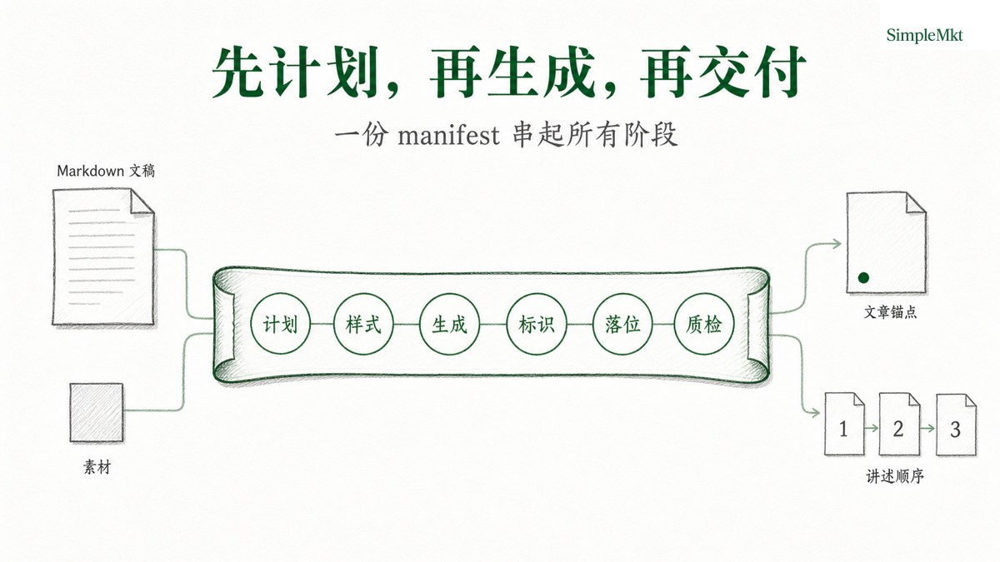

<p align="center">
  
</p>

<div align="center">

# smkt-article-visual

**Turn key judgments in a narrative into images people can understand at a glance and continue explaining with.**

</div>

<p align="justify">
Turn structured narratives—articles, talks, reports, proposals, and workshop outlines—into a coherent cover and content-image system. It does not start from an isolated visual prompt: it first compiles the source meaning into image decisions, selects an appropriate grammar, and delivers a traceable image package in SimpleMkt editorial style. <code>article_package</code> places content images where readers need them; <code>presentation_frames</code> uses the same image system to organize a continuous presentation.
</p>

<div align="center">

Designed for Codex and Agents with image-generation capability.

[SimpleMkt](https://simplemkt.cc) · [X](https://x.com/AlchemistZhou) · [Xiaohongshu](https://www.xiaohongshu.com/user/profile/65a0ecb4000000002201219c) · [Douyin](https://www.douyin.com/user/MS4wLjABAAAArV0uXvsSYl6pD-p5nr-5OFlZED5cEUnb7r2K6j9u4tA)

[Official repository](https://github.com/Lone3m-tech/smkt-article-visual) · [Current published identity v0.7.0 (installation verification pending)](https://github.com/Lone3m-tech/smkt-article-visual/releases/tag/v0.7.0)

[View the 13 visual-grammar demos](#visual-grammar-reference) · [View the Skill runtime contract](SKILL.md)

**[简体中文](README.md) | English**

</div>

## Why this Skill

| Product strength | What it means in use |
| --- | --- |
| **Judge first, then generate** | Find the real comprehension obstacle, choose one primary grammar, and name the source details that must survive before generation begins. |
| **One image system, two delivery strategies** | `article_package` supports local reading comprehension; `presentation_frames` turns selected narrative slices into a continuous explanation. |
| **Images explain rather than decorate** | A unified editorial image language makes the source's objects, actions, states, positions, and relationships legible. One content image answers one core question; it does not fill empty space beside prose. |
| **Usable and reviewable** | Images land at approved paragraph anchors or in an established narrative order; prompts, assets, and delivery state live in one manifest; Logo detection is automatic and QA reports without automatically reworking output. |

The shared purpose is simple: reduce cognitive load for readers or audiences, so the creator can communicate what is already present in the narrative more clearly.

## Install

These are public candidate installation paths. The isolated installation receipt covers `npx skills add --copy` and direct Git cloning at v0.5.0; do not describe v0.7.0 as an installation-verified release until that isolated check has been rerun.

```bash
npx skills add Lone3m-tech/smkt-article-visual \
  --skill smkt-article-visual \
  --global \
  --agent codex \
  --copy
```

Or clone it into Codex's global Skill directory:

```bash
mkdir -p ~/.codex/skills
git clone --depth 1 https://github.com/Lone3m-tech/smkt-article-visual.git \
  ~/.codex/skills/smkt-article-visual
```

Remove `--global` for a project installation. Another Agent host can complete the workflow only when it can read and write local files, invoke an equivalent image-generation capability, and satisfy the dependencies below; this README does not claim universal host compatibility.

## Start

Give the Agent the source Markdown and delivery goal. Start in planning mode:

```yaml
source_path: ./article.md
delivery_mode: article_package
mode: plan
existing_assets: []
```

Example request:

> Create an article visual package for `article.md`. Show the plan first, then generate only after approval. Do not rewrite the prose.

After plan approval:

```yaml
source_path: ./article.md
delivery_mode: article_package
mode: generate
enable_qa: false
```

## How it works

The input is accessible Markdown plus optional real source assets. The output is a cover, necessary explanatory images, and `assets/image/manifest.json`.

| Mode | Default and input condition | Delivery boundary |
| --- | --- | --- |
| `article_package` | Default; the source needs an H1. | Place the cover after the H1 and each approved figure once after its source anchor; do not rewrite the prose. |
| `presentation_frames` | Use only for an explicit presentation, slides, deck, or PPT request; supply `presentation_title` if the source has no H1. | Store a cover and ordered narrative frames; leave the source unchanged. |
| `plan` / `generate` / `qa` | `plan` is default; `generate` reuses a ready plan; `qa` reports only. | Update one manifest in sequence; do not create separate plan or run files. |

Logo needs no setting. The finalizer detects only the regular PNG in `assets/logo/` whose name matches the style contract: it applies that asset when present and skips it when missing or symlinked. The model must not render a Logo, brand name, or watermark. `enable_qa` is off by default. Enabling it reports findings but never redraws, rewrites prompts, or changes prose automatically.



## What it does

- Find an explanation task in a source-supported mechanism, process, feedback loop, comparison, boundary, hierarchy, or argument.
- Define one source-supported cover promise; reproduce the H1 or explicit `presentation_title` exactly as the cover title.
- Specify one reader question, core judgment, required relationship, and primary grammar per content image.
- Keep planning, actual prompts, generated files, Logo handling, placement or sequence, and QA state in one manifest.
- Handle real screenshots, paper figures, data charts, or UI images as supplied source material instead of presenting generated illustration as evidence.

Grammar makes a source relationship legible; it never adds data, causality, or conclusions. Read [references/visual-grammar.md](references/visual-grammar.md) for selection rules.

## Where it helps

- An H1-led article or research report needing a cover and explanatory figures at real reading obstacles.
- A talk or keynote needing a continuous visual explanation of its key mechanism.
- A consulting proposal needing a clearer option, comparison, or decision boundary without producing an editable PPTX.
- A teaching or workshop outline that needs an abstract relationship turned into a followable visual.

## Who it is for

Creators, content teams, consultants, researchers, and educators who already have an argument and need readers or audiences to understand its relationships sooner.

## Who it is not for

- Standalone posters, mood images, or social-only covers.
- Article writing, CMS-brief management, publishing, platform upload, or outcome guarantees.
- A complete deck, editable PPTX, or presentation-software implementation.
- Fabricated screenshots, source images, data, or unlicensed third-party material.

## Core capabilities

The product is useful because its runtime contract is explicit, not because it promises a universal visual result:

- A content image answers one primary question with one primary grammar. It does not create dashboards, card walls, data panels, or unsupported charts.
- A `comparison` needs source-supported, visible left/right differences beyond labels.
- An accepted article image appears once at its approved anchor; multiple references stop for human resolution.
- Generated work is editorial illustration. Real-source material must be supplied and recorded explicitly.

Use [SKILL.md](SKILL.md) for runtime fields, prompt compilation, Logo finalization, and QA rules.

## Visual grammar reference

These 13 images show only the structural relationship each grammar is designed to organize. They are not facts or data; a real delivery must still be determined by source support, the reader question, and `must_show`.

| Grammar | Reference |
| --- | --- |
| Architecture (`architecture`) |  |
| Hierarchy (`hierarchy`) |  |
| Flow (`flow`) |  |
| Loop (`loop`) |  |
| Decision tree (`decision_tree`) |  |
| Comparison (`comparison`) |  |
| Matrix (`matrix`) |  |
| Overlap map (`overlap_map`) |  |
| Boundary map (`boundary_map`) |  |
| Argument map (`argument_map`) |  |
| Timeline (`timeline`) |  |
| Continuum (`continuum`) |  |
| Layer stack (`layer_stack`) |  |

## Requirements and limitations

- Requires an Agent host with local file read/write access and `image_gen` or an equivalent capability.
- Logo finalization requires Python 3.10+ and Pillow from [`scripts/requirements.txt`](scripts/requirements.txt). The Skill does not install dependencies or repair generated work with another renderer.
- Successful installation alone does not prove end-to-end image behavior; that depends on the host image capability.
- The current public package has no reproducible end-to-end Demo aligned to the latest schema 5 contract. Historic examples and presentation images are therefore not offered as current proof.
- The latest isolated product test completed functional checks but remains `blocked` because its retained trace exposes a host-internal generated-image path. Until that leakage is resolved, it is not evidence of complete cross-host or end-to-end acceptance.
- Each user remains responsible for input rights, third-party image-model terms, and redistribution permission.

## License

[MIT License](LICENSE)
