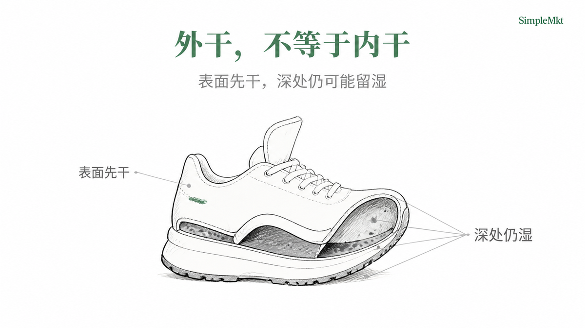
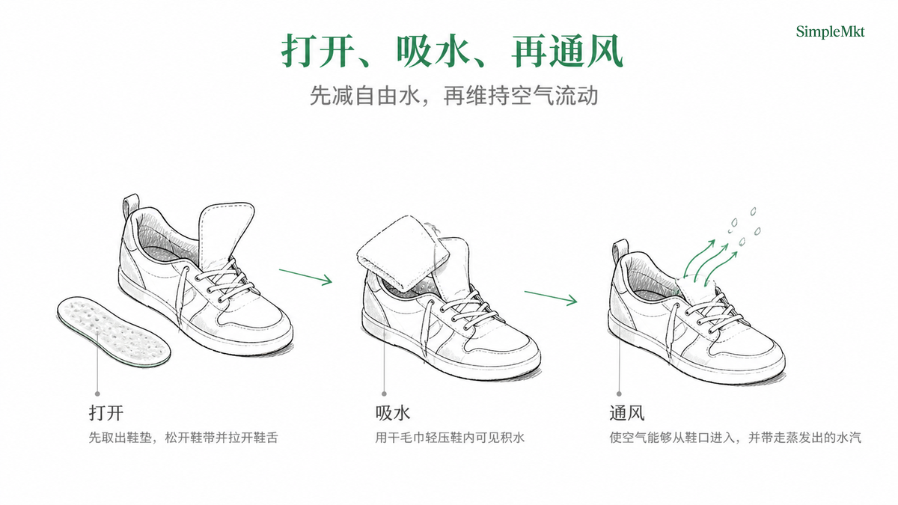
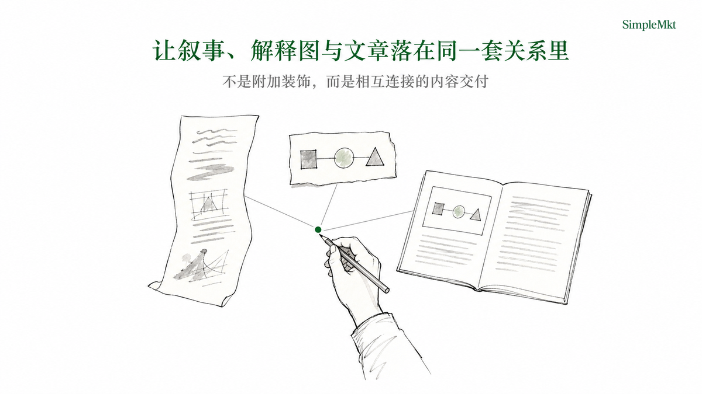

<div align="center">

# smkt-article-visual

**把已有叙事中的理解关系，变成可审核、可落位、可连续讲述的视觉包。**

</div>

<p align="justify">
它不代写文章，也不为正文补一张装饰图。它把文章、演讲稿、报告、提案或工作坊提纲中的既有关系，先编译成可审核的配图判断，再以统一的封面与内容图系统交付。<code>article_package</code> 把解释图落在读者需要理解的位置；<code>presentation_frames</code> 则把同一套判断组织成连续讲述。
</p>

<div align="center">

为 Codex 与具备生图能力的 Agent 而设计。

[SimpleMkt](https://simplemkt.cc) · [X](https://x.com/AlchemistZhou) · [小红书](https://www.xiaohongshu.com/user/profile/65a0ecb4000000002201219c) · [抖音](https://www.douyin.com/user/MS4wLjABAAAArV0uXvsSYl6pD-p5nr-5OFlZED5cEUnb7r2K6j9u4tA)

[官方仓库](https://github.com/Lone3m-tech/smkt-article-visual) · [查看 Releases](https://github.com/Lone3m-tech/smkt-article-visual/releases)

[查看 13 种图法 Demo](#图法参考) · [查看 Skill 运行契约](SKILL.md)

**简体中文 | [English](README.en.md)**

</div>


## 为什么是这个 Skill

普通生图 Prompt 解决“给我一张图”；这个 Skill 解决“读者应当从这段叙事理解什么，以及那层关系该如何被看见”。前者的语义判断留给人手工补齐，后者把来源支持、读者卡点、图法、可见证据与落位记录在同一份页面 manifest 中。

| 产品亮点 | 落到实际使用中 |
| --- | --- |
| **关系先于画面** | 先找理解卡点，再选择一个主图法，并为每张正文图声明 `annotation_plan`；不是先出图、再为它找解释。 |
| **两种交付策略** | `article_package` 服务局部阅读理解；`presentation_frames` 把经过筛选的原文叙事切片组织成连续讲述。 |
| **可审核的交付** | Prompt、生成文件、Logo、落位与 QA 状态记录在同一份 manifest；模型不伪造来源证据，QA 不会自动重做或改写正文。 |

共同目的很简单：降低读者或听众的认知负担，让内容生产者更清楚地输出叙事中原本就存在的信息。


## 安装

以下是面向 Codex 的公开安装候选路径。安装成功只说明文件已就位；是否能完成整条工作流仍取决于宿主的本地文件权限、图像生成能力和下述依赖。

```bash
npx skills add Lone3m-tech/smkt-article-visual \
  --skill smkt-article-visual \
  --global \
  --agent codex \
  --copy
```

或克隆到 Codex 的全局 Skill 目录：

```bash
mkdir -p ~/.codex/skills
git clone --depth 1 https://github.com/Lone3m-tech/smkt-article-visual.git \
  ~/.codex/skills/smkt-article-visual
```

去掉 `--global` 可安装到单个项目。对其它 Agent 宿主，只有在它能读取和写入本地文件、调用等效图像生成能力并满足下述依赖时，才可能完成整个工作流；本 README 不声明通用兼容性。

## 已验证的 Agent

以下宿主已完成本 Skill 的实际运行。支持范围限定为本地文件读写、页面级 Prompt 编译、图像生成与终处理；不表示联合发布、合作关系或对未测试宿主的兼容性承诺。

| Agent | 实测状态 | 已验证范围 |
| --- | --- | --- |
| <br>**Codex** | 已实测 | 可执行本 Skill 的完整本地工作流。 |
| <br>**豆包** | 已实测 | 可执行本 Skill 的完整本地工作流。 |

Logo 分别归 OpenAI 与豆包所有，仅用于识别已实测的对应 Agent；不暗示任何背书或合作。

## 开始使用

把源 Markdown 和交付目标交给 Agent。默认先只做计划：

```yaml
source_path: ./article.md
delivery_mode: article_package
mode: plan
existing_assets: []
```

例如：

> 为 `article.md` 制作文章视觉包。先给我配图计划；确认后再生成。不要改写正文。

确认计划后：

```yaml
source_path: ./article.md
delivery_mode: article_package
mode: generate
enable_qa: false
```

### 最小成功标准

一次合格运行不是“生成了几张好看的图”，而是同时满足：每张正文图只解释一个原文支持的关系；遮住标题后，读者仍能从对象、位置与必要标注读出关系；接受的图片只落在对应锚点一次，且原文没有被改写。

## 内置完整示例

[`examples/demo-article/article.md`](examples/demo-article/article.md) 是一篇已完成的 `article_package` 示例：它从“清洗后的运动鞋不宜直接贴近暖气烘干”这篇短文中，选出一个对比关系与一个流程关系，生成封面和两张正文解释图。该示例的 manifest 为 schema 9，三页均已 `placed`；它展示包内成果形态，不构成护理建议的验证。

| 原文中的理解关系 | 选择的图法 | 结果 |
| --- | --- | --- |
| 表面已经干燥，并不代表整双鞋已适合穿着。 | `comparison` |  |
| 先打开结构、吸除水分，再保持通风。 | `flow` |  |


## 如何工作

本 README 的开头海报、正文展示图、已验证 Agent 标识与配套 manifest 集中在 [`examples/readme-visual/`](examples/readme-visual/)；它们是文档演示资产，不是使用本 Skill 时生成的 `assets/image/` 交付物。

输入是一份可访问的 Markdown 叙事和可选的真实已有素材；输出是封面、必要的解释图和一个 `assets/image/manifest.json`。文章模式写入文章根目录，演示模式写入 `presentation_output_root`；Skill 自带的图法参考则固定在 [`examples/visual-grammar/`](examples/visual-grammar/)，不属于某次运行的交付物。

| 模式 | 默认与输入要求 | 交付边界 |
| --- | --- | --- |
| `article_package` | 默认模式；源文必须有 H1。 | 在 H1 后插入封面，在每个已批准的段落锚点后插入一次内容图；不改写正文。 |
| `presentation_frames` | 只在用户明确要求演示、slides、deck 或 PPT 时使用；没有 H1 时提供 `presentation_title`。 | 保存封面和按叙事顺序排列的讲述图；源文保持不变。 |
| `plan` / `generate` / `qa` | 默认 `plan`；`generate` 按页编译 Prompt 并逐张生成；`qa` 检查已有生成图。 | 计划、图法、每张正文图的 `annotation_plan`、实际 Prompt、生成、QA 与交付状态依次写入同一份 manifest，不另建 plan 或 run 文件。 |



页面身份只有四种：`cover` 用于建立阅读承诺，`body` 解释一个原文支持的关系，`agenda` 只在 `presentation_frames` 中为三项以上正文节奏定向，`closing` 只在演示末尾使用标准结束语。封面不是正文图法；`agenda` 与 `closing` 也不承载新的原文主张。

Logo 无需配置：终处理脚本只检测 `assets/logo/` 中、且与样式契约同名的普通 PNG；找到便叠加，缺失或为符号链接便跳过。模型不得绘制 Logo、品牌名或水印。`enable_qa` 默认关闭；关闭时生成图直接进入终处理与落位，开启时只有通过 QA 的图片才会打 Logo 并落位。QA 不会自动重画、改 Prompt 或改写原文。

## Demo：演示页布局

下面的版式 Demo 只展示 `presentation_frames` 的页面身份与留白组织，不承载任何文章事实。实际页面仍须从已计划的原文支持、精确可见文字与所选 `layout_variant` 编译生成。

### 封面

| `text_left_carrier_right` | `text_right_carrier_left` |
| --- | --- |
|  |  |

| `text_top_carrier_bottom` | `text_centered` |
| --- | --- |
|  |  |

### 目录

| `centered_list` | `split_list` |
| --- | --- |
|  |  |

| `vertical_rail` | `stepped_list` |
| --- | --- |
|  |  |

### 结尾

| `editorial_signoff` | `baseline_signoff` | `echo_signoff` |
| --- | --- | --- |
|  |  |  |

## 可控边界

- 每张正文图只解释一个原文支持的关系；图法不能补造数据、因果或结论。
- `comparison` 必须有肉眼可见的结构差异；真实截图、论文图、数据图与 UI 图只能作为显式传入的来源素材处理。
- 已接受的文章图只在对应锚点出现一次；细化的选择规则、Prompt 编译和 QA 契约分别见 [references/visual-grammar.md](references/visual-grammar.md)、[references/manifest-contract.md](references/manifest-contract.md) 与 [SKILL.md](SKILL.md)。

## 用在哪些场景

| 谁在什么任务中使用 | 产出什么 | 为什么此时适合 |
| --- | --- | --- |
| 长文作者或内容团队 | 有封面和段落锚点解释图的文章包 | 将读者需要自行消化的关系变成可见判断，而不重写文章。 |
| 策略、咨询或研究人员 | 用于分享与提案的连续讲述画面 | 让方案差异、机制和边界脱离口头补充，也不把交付伪装成可编辑 PPTX。 |
| 培训者与工作坊组织者 | 跟随讲述节奏的解释页 | 将抽象步骤、反馈或层级关系变成可跟随的视觉结构。 |


## 不适合谁

- 需要独立海报、情绪图或纯社交媒体封面的人。
- 希望 Skill 代写文章、管理 CMS Brief、发布内容、上传到平台或提供效果保证的人。
- 需要完整 Deck、可编辑 PPTX 或演示软件工程的人。
- 希望伪造截图、来源图片、数据或未经授权第三方素材的人。

## Demo：正文图法

以下 13 张正文图只展示每种图法应组织的结构关系，文件位于 [`examples/visual-grammar/`](examples/visual-grammar/)；它们不承载事实或数据。正式生成时，仍必须由原文支持的关系、读者问题与 `must_show` 决定内容。

| 图法 | 参考图 |
| --- | --- |
| 架构（`architecture`） |  |
| 层级（`hierarchy`） |  |
| 流程（`flow`） |  |
| 循环（`loop`） |  |
| 决策树（`decision_tree`） |  |
| 对比（`comparison`） |  |
| 矩阵（`matrix`） |  |
| 交集（`overlap_map`） |  |
| 边界（`boundary_map`） |  |
| 论证（`argument_map`） |  |
| 时间线（`timeline`） |  |
| 连续谱（`continuum`） |  |
| 层叠（`layer_stack`） |  |

## 依赖与限制

- 需要一个可读写本地文件、并能调用 `image_gen` 或等效能力的 Agent 宿主。
- Logo 终处理需要 Python 3.10+ 与 [`scripts/requirements.txt`](scripts/requirements.txt) 中的 Pillow；Skill 不会自动安装依赖，也不会用另一套渲染器修补生成图。
- 完整视觉效果依赖宿主的图像生成能力，不能仅凭安装成功推断。
- 包内含有与现行 manifest 契约对齐的 `examples/demo-article/` 成果示例；它说明输入、页面计划与图片交付形态，不代替隔离跨宿主运行的验证。
- 最新隔离产品测试仍因运行 trace 暴露宿主内部生成路径而处于 `blocked`；在该问题消除前，不把它作为完整跨宿主或端到端通过的证据。
- 每次使用者仍须确保输入素材、第三方图像模型条款与再分发授权合规。

## License

[MIT License](LICENSE)
