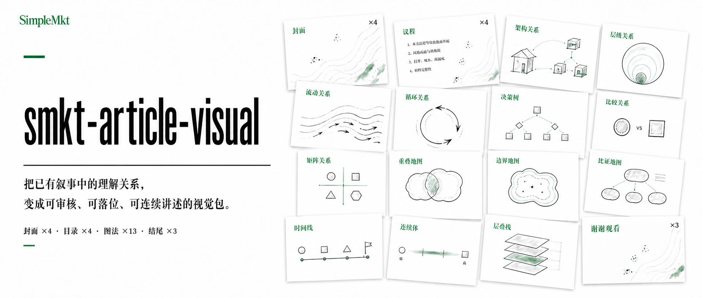

<div align="center">

# smkt-article-visual

**把已有叙事中的理解关系，变成可审核、可落位、可连续讲述的视觉包。**

为 Codex 与具备生图能力的 Agent 而设计。

[SimpleMkt](https://simplemkt.cc) · [X](https://x.com/AlchemistZhou) · [小红书](https://www.xiaohongshu.com/user/profile/65a0ecb4000000002201219c) · [抖音](https://www.douyin.com/user/MS4wLjABAAAArV0uXvsSYl6pD-p5nr-5OFlZED5cEUnb7r2K6j9u4tA)

[官方仓库](https://github.com/Lone3m-tech/smkt-article-visual) · [查看 Releases](https://github.com/Lone3m-tech/smkt-article-visual/releases) · [查看 13 种图法](#8-13-种正文图法) · [查看运行契约](SKILL.md)

**简体中文 | [English](README.en.md)**

</div>

> 它不代写文章，也不为正文补一张装饰图。它先把文章、演讲稿、报告、提案或工作坊提纲中已有的理解关系，编译成可审核的配图判断，再交付统一的封面与解释图系统。

## 1. 它解决什么

普通生图 Prompt 解决“给我一张图”；这个 Skill 解决“读者应该从这段叙事理解什么，以及这层关系如何被看见”。

1. **先判断关系**：先定位读者的理解卡点，再选择一个主图法；不是先出图、再补解释。
2. **按阅读位置交付**：`article_package` 把解释图放在对应段落；`presentation_frames` 把同一套判断编成连续讲述。
3. **让结果可审核**：来源支持、图法、页面 Prompt、生成图、Logo、落位与 QA 状态都记录在一份页面化 manifest 中。

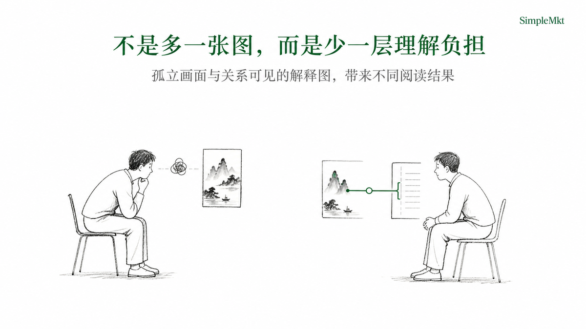

## 2. 什么时候用

适合以下三类任务：

- **文章或内容团队**：把正文中需要读者自行消化的关系，变成封面和段落锚点解释图，而不改写文章。
- **策略、咨询或研究分享**：把方案差异、机制和边界组织成可连续讲述的画面，而不是伪装成可编辑 PPTX。
- **培训与工作坊**：把步骤、反馈、层级或取舍变成可跟随的视觉结构。

不适合以下需求：

- 独立海报、情绪图或纯社交媒体封面。
- 代写文章、管理 CMS Brief、发布内容、上传平台或承诺传播效果。
- 完整 Deck、可编辑 PPTX 或演示软件工程。
- 伪造截图、来源图片、数据或未经授权的第三方素材。

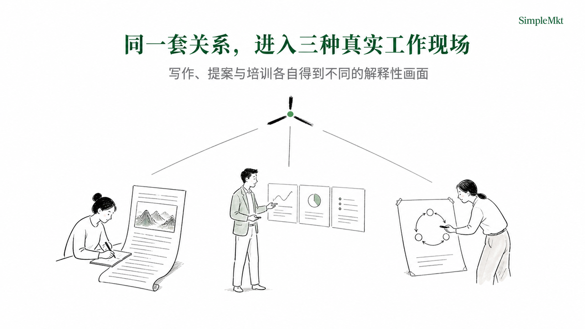

## 3. 安装与已验证 Agent

面向 Codex 的公开安装方式：

```bash
npx skills add Lone3m-tech/smkt-article-visual \
  --skill smkt-article-visual \
  --global \
  --agent codex \
  --copy
```

也可以克隆到 Codex 全局 Skill 目录：

```bash
mkdir -p ~/.codex/skills
git clone --depth 1 https://github.com/Lone3m-tech/smkt-article-visual.git \
  ~/.codex/skills/smkt-article-visual
```

去掉 `--global` 可安装到单个项目。安装成功只说明文件已就位；完整工作流仍要求宿主能读写本地文件并调用等效的图像生成能力。

已完成实际运行的宿主：

- 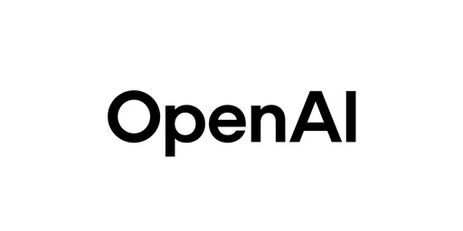 **Codex**：已验证本地文件读写、页面级 Prompt 编译、图像生成与终处理。

Logo 归 OpenAI 所有，仅用于识别已实测 Agent；不暗示背书或合作。

## 4. 开始使用

### 4.1 准备来源

来源可以是：

- 直接可读的 Markdown；
- 可导出的本地 Word / Docs 文档；
- 已授权可读取的飞书文档；
- 可选的真实已有素材。

非 Markdown 来源先整理为本地 Markdown 工作副本。它必须保留原意、H1 和段落结构；`source_path`、页面锚点与 manifest 都以这个副本为准。Skill 不会回写原始文档或飞书。

### 4.2 先给出计划

```yaml
source_path: ./article.md
delivery_mode: article_package
mode: plan
existing_assets: []
```

可以这样交代任务：

> 为 `article.md` 制作文章视觉包。先给我配图计划；确认后再生成。不要改写正文。

### 4.3 确认后生成

```yaml
source_path: ./article.md
delivery_mode: article_package
mode: generate
enable_qa: false
```

## 5. 如何工作

本 README 的海报、正文展示图、已验证 Agent 标识与配套 manifest 都在 [`examples/readme-visual/`](examples/readme-visual/)；它们只是文档演示资产，不是实际运行时的 `assets/image/` 交付物。

### 两种交付方式

- **`article_package`**：默认模式。来源需要 H1；在 H1 后放封面，在每个已批准的段落锚点后放一次内容图；正文不改写。
- **`presentation_frames`**：只在明确要求演示、slides、deck 或 PPT 时使用。它保存封面、必要时的目录、按叙事顺序排列的讲述图和结尾；源文保持不变。没有 H1 时提供 `presentation_title`。

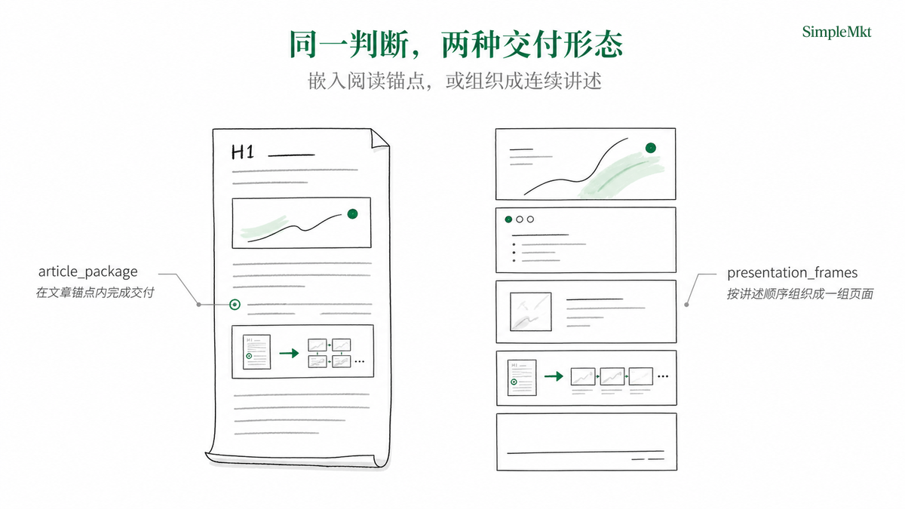

### 三步工作流

1. **计划**：从本地 Markdown 工作副本抽取一条精确来源支持，识别读者卡点，选择一张图法和可见证据。
2. **逐页生成**：编译每一页的 Prompt，分别生成封面、必要的正文解释图，或演示页。
3. **终处理与落位**：按需进行粗粒度 QA，叠加 Logo，把已接受图片放到唯一的文章锚点或演示序列。

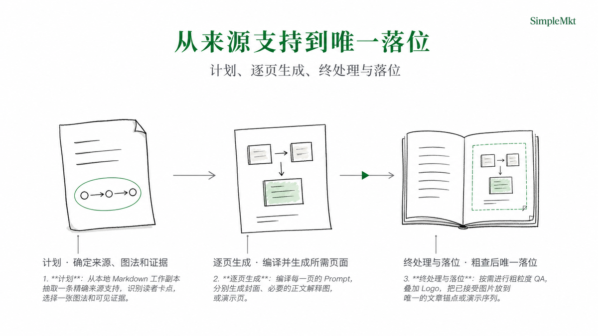

### 四种页面身份

- **`cover`**：建立阅读承诺，不使用正文图法。
- **`body`**：解释一个原文支持的关系。
- **`agenda`**：仅用于演示模式中三项以上讲述节奏的定向。
- **`closing`**：仅用于演示末尾的标准结束语。

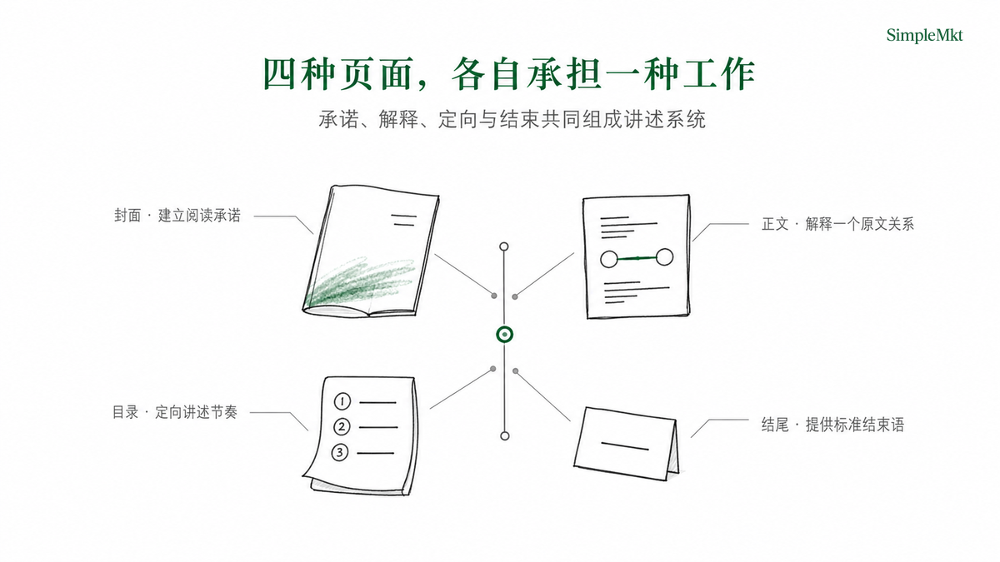

一次合格运行应同时满足：每张正文图只解释一个原文支持的关系；遮住标题后仍能从对象、位置与必要标注读出关系；每张接受图片只落在批准锚点一次；原文不被改写。

## 6. 内置示例


[《为什么清洗后的运动鞋不宜直接贴近暖气烘干？》](examples/demo-article/article.md)

## 7. 演示页布局

以下版式只展示 `presentation_frames` 的页面身份与留白组织；真实页面仍要从计划好的来源支持、精确可见文字与 `layout_variant` 编译生成。

### 封面（4 种）

| `text_left_carrier_right` | `text_right_carrier_left` |
| --- | --- |
| 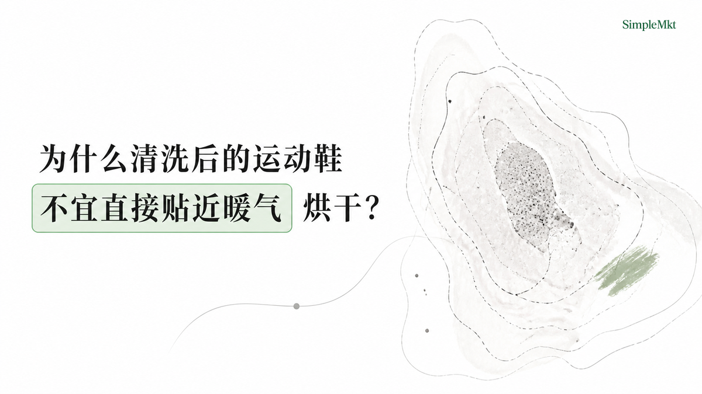 | 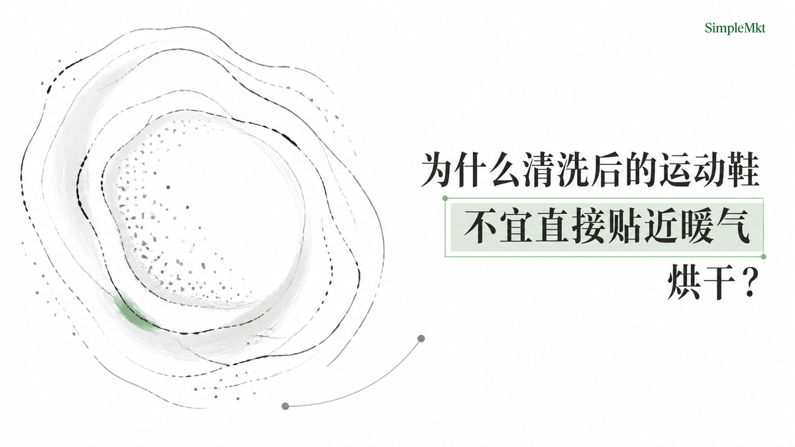 |

| `text_top_carrier_bottom` | `text_centered` |
| --- | --- |
| 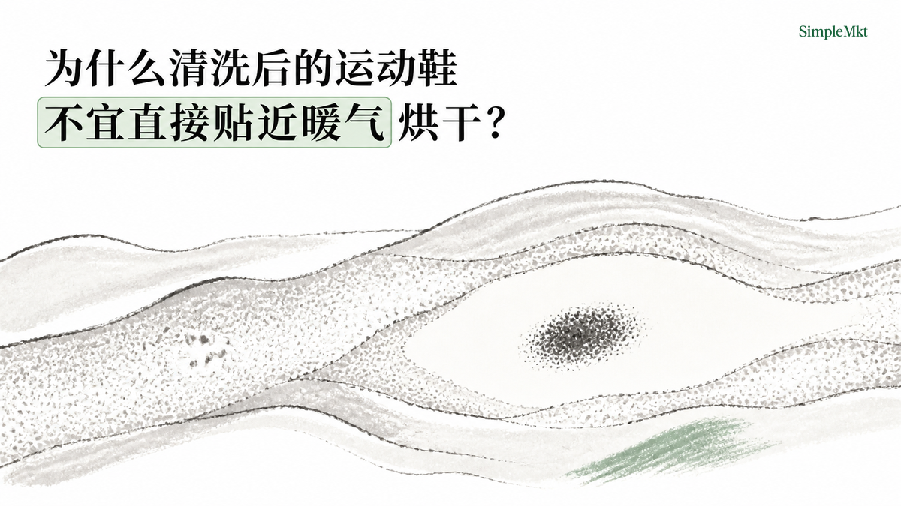 |  |

### 目录（4 种）

| `centered_list` | `split_list` |
| --- | --- |
| 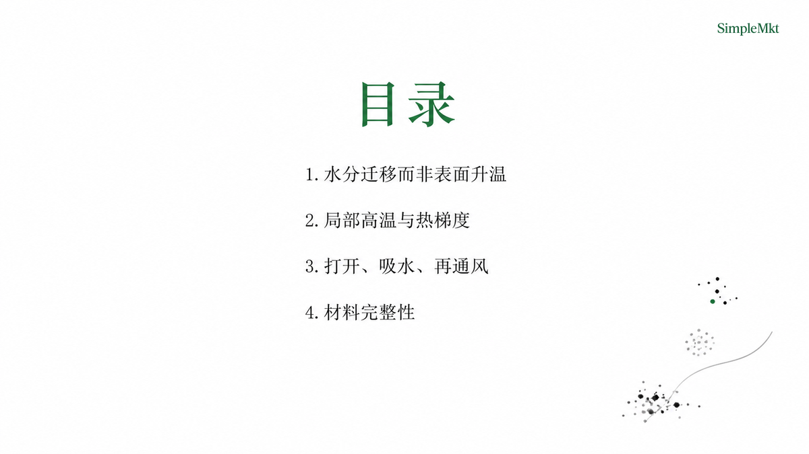 | 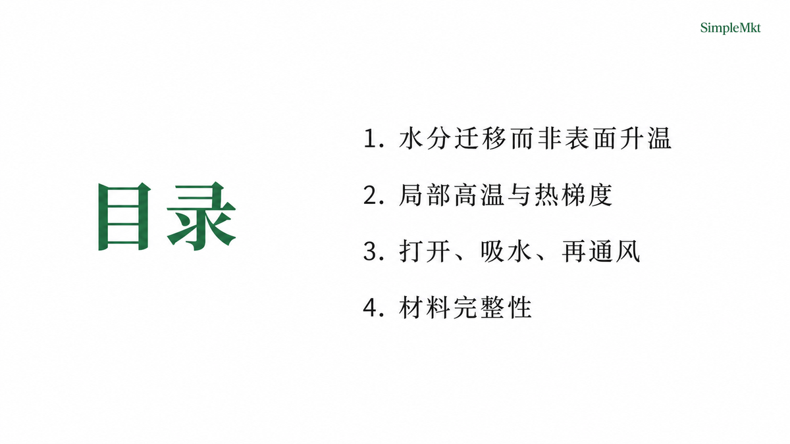 |

| `vertical_rail` | `stepped_list` |
| --- | --- |
| 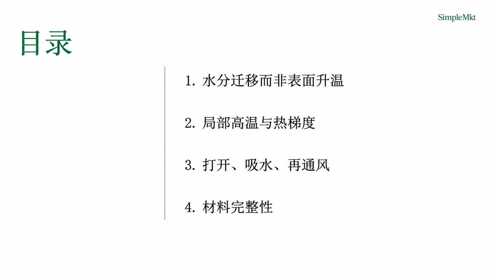 | 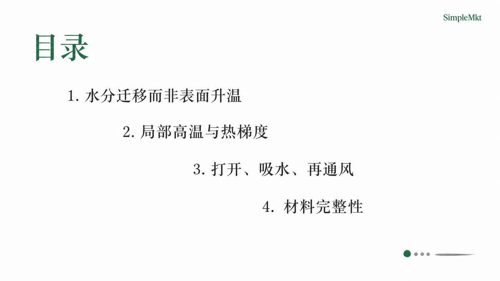 |

### 结尾（3 种）

| `editorial_signoff` | `baseline_signoff` | `echo_signoff` |
| --- | --- | --- |
| 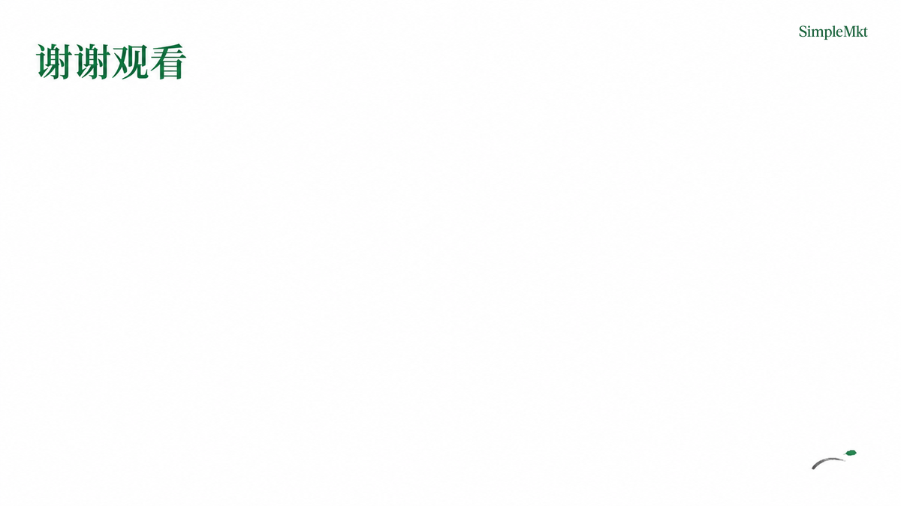 | 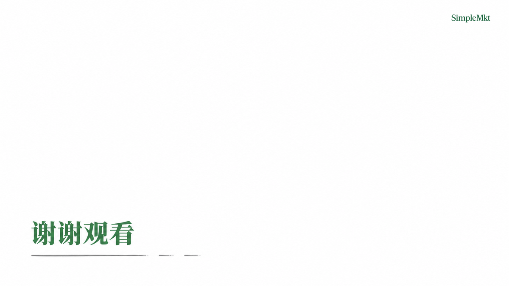 |  |

## 8. 13 种正文图法

每种图法只展示应组织的关系结构，不承载事实或数据。正式生成仍由原文支持、读者问题与 `must_show` 决定内容。

| 架构（`architecture`） | 层级（`hierarchy`） |
| --- | --- |
|  | 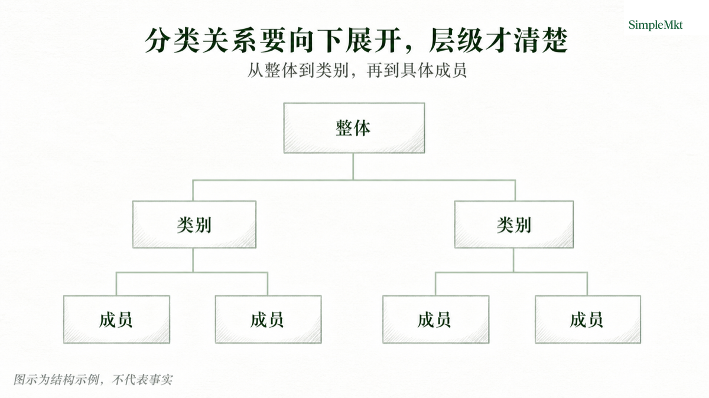 |

| 流程（`flow`） | 循环（`loop`） |
| --- | --- |
|  |  |

| 决策树（`decision_tree`） | 对比（`comparison`） |
| --- | --- |
| 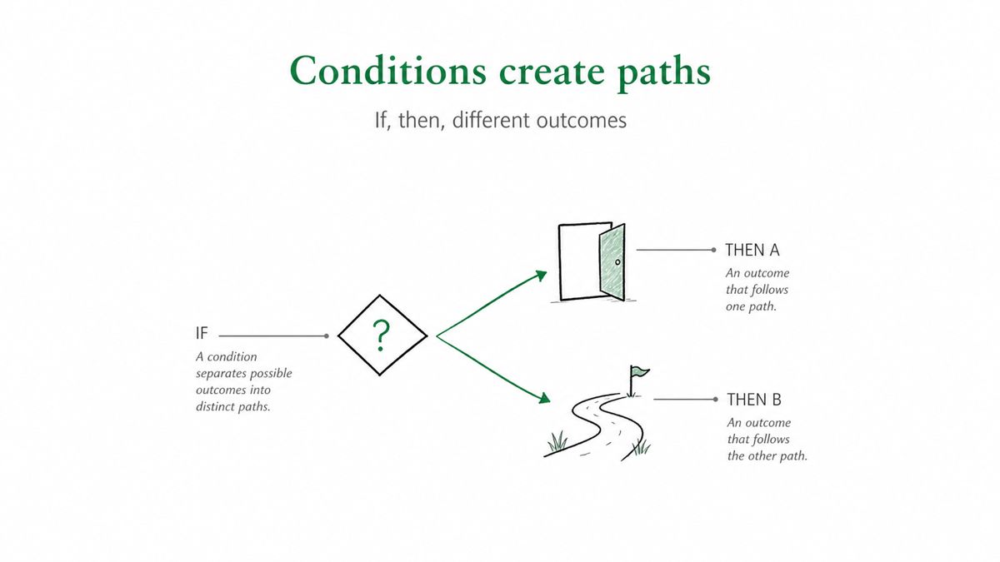 |  |

| 矩阵（`matrix`） | 交集（`overlap_map`） |
| --- | --- |
|  | 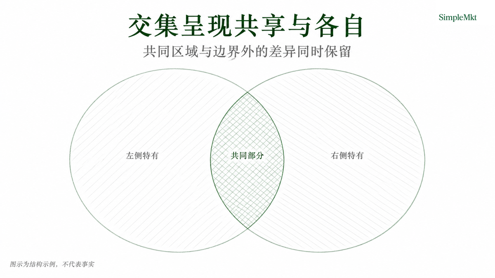 |

| 边界（`boundary_map`） | 论证（`argument_map`） |
| --- | --- |
| 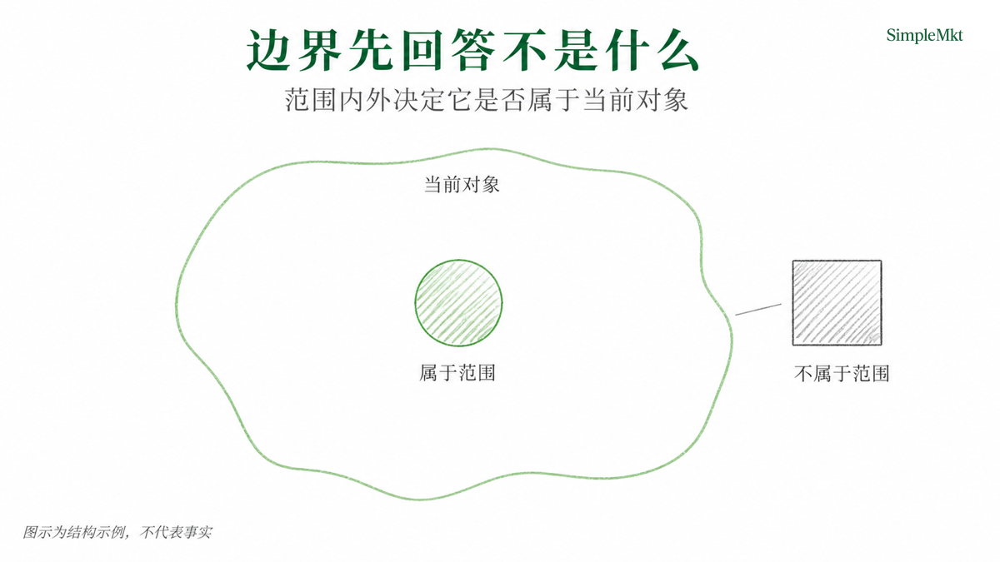 | 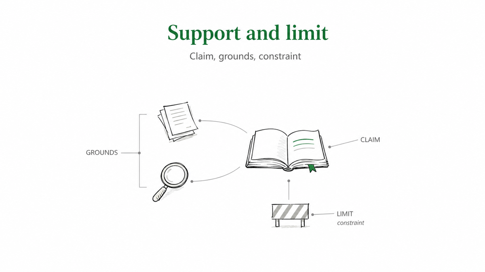 |

| 时间线（`timeline`） | 连续谱（`continuum`） |
| --- | --- |
|  |  |

| 层叠（`layer_stack`） |  |
| --- | --- |
| 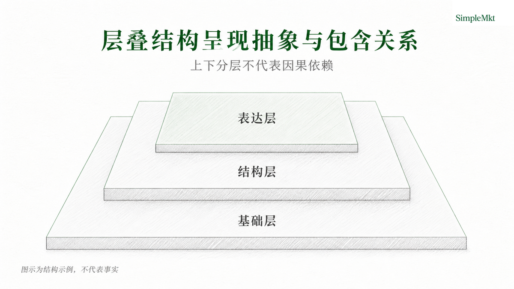 |  |

## 9. 可控边界

- 每张正文图只解释一个原文支持的关系；图法不能补造数据、因果或结论。
- `comparison` 必须有肉眼可见的结构差异。
- 真实截图、论文图、数据图与 UI 图只能作为显式传入的来源素材处理，不得伪造。
- 已接受的文章图只在对应锚点出现一次。
- 细化的选择规则、Prompt 编译与 QA 契约分别见 [references/visual-grammar.md](references/visual-grammar.md)、[references/manifest-contract.md](references/manifest-contract.md) 与 [SKILL.md](SKILL.md)。

## 10. 依赖与限制

- 需要一个可读写本地文件、并能调用 `image_gen` 或等效能力的 Agent 宿主。
- Logo 终处理需要 Python 3.10+ 与 [`scripts/requirements.txt`](scripts/requirements.txt) 中的 Pillow；Skill 不会自动安装依赖，也不会用另一套渲染器修补生成图。
- 完整视觉效果依赖宿主的图像生成能力，不能仅凭安装成功推断。
- 每次使用者仍须确保输入素材、第三方图像模型条款与再分发授权合规。

## License

[MIT License](LICENSE)
