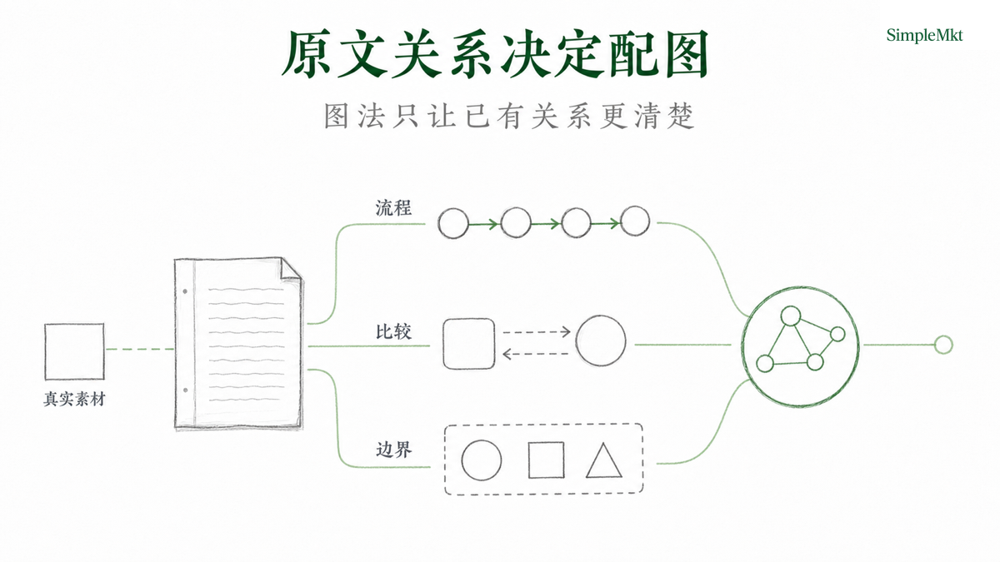
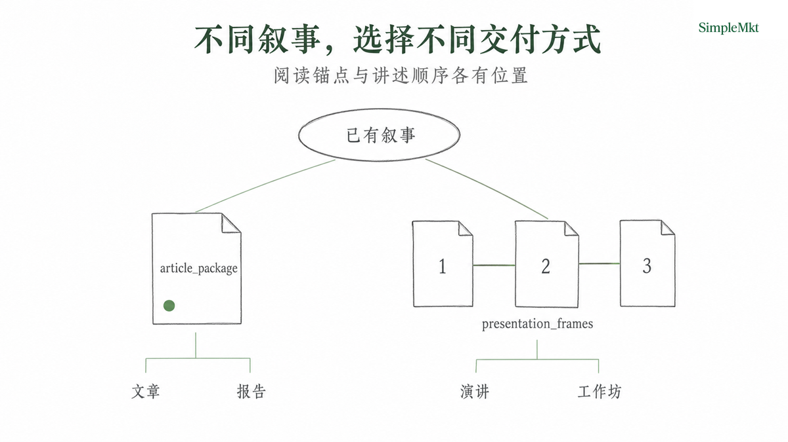
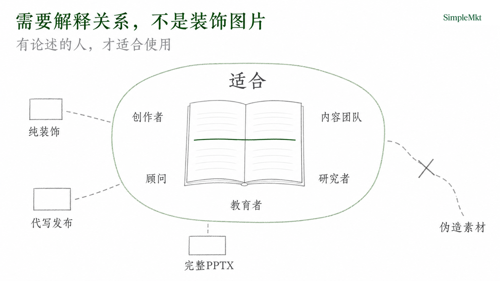
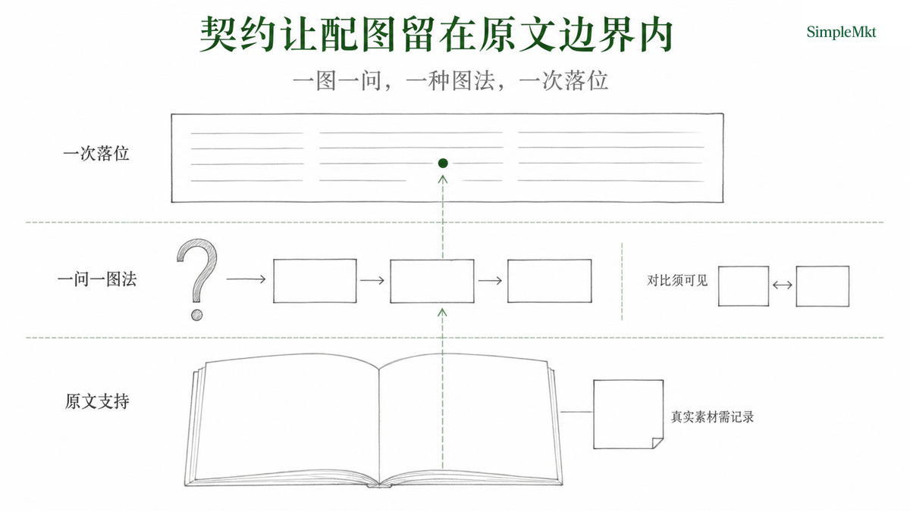

<p align="center">
  
</p>

<div align="center">

# smkt-article-visual

**把叙事里的关键判断，变成一眼看懂、能继续讲下去的图片。**

</div>

<p align="justify">
把文章、演讲稿、报告、提案或工作坊提纲这类结构化叙事，变成一套统一的封面与内容图系统。它不从一条孤立的视觉 Prompt 开始，而是先把原文原意编译成配图判断，选择合适图法，再以 SimpleMkt 编辑图风格交付可追溯的图片包。<code>article_package</code> 把内容图放在读者需要理解的位置；<code>presentation_frames</code> 则用同一套图片系统组织连续讲述。
</p>

<div align="center">

为 Codex 与具备生图能力的 Agent 而设计。

[SimpleMkt](https://simplemkt.cc) · [X](https://x.com/AlchemistZhou) · [小红书](https://www.xiaohongshu.com/user/profile/65a0ecb4000000002201219c) · [抖音](https://www.douyin.com/user/MS4wLjABAAAArV0uXvsSYl6pD-p5nr-5OFlZED5cEUnb7r2K6j9u4tA)

[官方仓库](https://github.com/Lone3m-tech/smkt-article-visual) · [当前发布身份 v0.6.0（安装待复验）](https://github.com/Lone3m-tech/smkt-article-visual/releases/tag/v0.6.0)

[查看 13 种图法 Demo](#图法参考) · [查看 Skill 运行契约](SKILL.md)

**简体中文 | [English](README.en.md)**

</div>

## 为什么是这个 Skill

| 产品亮点 | 落到实际使用中 |
| --- | --- |
| **先判断，再出图** | 先找真正的理解卡点，选择一个主图法，并明确哪些原文细节必须在图中保留，再开始生成。 |
| **一套图片系统，两种交付策略** | `article_package` 服务局部阅读理解；`presentation_frames` 把经过筛选的原文叙事切片组织成连续讲述。 |
| **图片参与解释，不只是装饰** | 用统一的编辑图语言，把原文中的对象、动作、状态、位置和关系可视化。一张内容图只回答一个核心问题，不填充正文旁的空白。 |
| **可用，也可复盘** | 图片落在确认过的段落锚点或既定讲述顺序；Prompt、生成文件与交付状态记录在同一份 manifest；Logo 自动检测后稳定落位，QA 只报告不自动重做。 |

共同目的很简单：降低读者或听众的认知负担，让内容生产者更清楚地输出叙事中原本就存在的信息。

## 安装

以下是公开安装候选路径。隔离安装记录验证过 `npx skills add --copy` 与直接 Git 克隆，但记录对应 v0.5.0；当前 v0.6.0 在重新完成隔离安装验证前，不应被表述为已验证的安装版本。

```bash
npx skills add Lone3m-tech/smkt-article-visual \
  --skill smkt-article-visual \
  --global \
  --agent codex \
  --copy
```

或克隆到 Codex 的全局 Skill 目录：

```bash
mkdir -p ~/.codex/skills
git clone --depth 1 https://github.com/Lone3m-tech/smkt-article-visual.git \
  ~/.codex/skills/smkt-article-visual
```

去掉 `--global` 可安装到单个项目。对其它 Agent 宿主，只有在它能读取和写入本地文件、调用等效图像生成能力并满足下述依赖时，才可能完成整个工作流；本 README 不声明通用兼容性。

## 开始使用

把源 Markdown 和交付目标交给 Agent。默认先只做计划：

```yaml
source_path: ./article.md
delivery_mode: article_package
mode: plan
existing_assets: []
```

例如：

> 为 `article.md` 制作文章视觉包。先给我配图计划；确认后再生成。不要改写正文。

确认计划后：

```yaml
source_path: ./article.md
delivery_mode: article_package
mode: generate
enable_qa: false
```

## 如何工作

输入是一份可访问的 Markdown 叙事和可选的真实已有素材；输出是封面、必要的解释图和一个 `assets/image/manifest.json`。

| 模式 | 默认与输入要求 | 交付边界 |
| --- | --- | --- |
| `article_package` | 默认模式；源文必须有 H1。 | 在 H1 后插入封面，在每个已批准的段落锚点后插入一次内容图；不改写正文。 |
| `presentation_frames` | 只在用户明确要求演示、slides、deck 或 PPT 时使用；没有 H1 时提供 `presentation_title`。 | 保存封面和按叙事顺序排列的讲述图；源文保持不变。 |
| `plan` / `generate` / `qa` | 默认 `plan`；`generate` 复用已就绪的计划；`qa` 只报告。 | 阶段依次写入同一份 manifest，不另建 plan 或 run 文件。 |

Logo 无需配置：终处理脚本只检测 `assets/logo/` 中、且与样式契约同名的普通 PNG；找到便叠加，缺失或为符号链接便跳过。模型不得绘制 Logo、品牌名或水印。`enable_qa` 默认关闭；打开后只报告，不会自动重画、改 Prompt 或改写原文。


## 它做什么

- 从原文已经存在的机制、流程、反馈、比较、边界、层级或论证中，选择值得用图压缩的理解障碍。
- 为封面确定一个原文支持的承诺；封面标题逐字使用 H1 或明确给出的 `presentation_title`。
- 为每张内容图写明读者问题、一个核心判断、必须呈现的关系和一种主图法。
- 以一份 manifest 保留计划、实际 Prompt、生成文件、Logo、文章落点或演示顺序及 QA 状态。
- 将真实截图、论文图、数据图或 UI 图作为用户提供素材处理，而不把生成插图伪装成证据。

图法只用于让原文关系可读，不会添加数据、因果或结论。完整选择规则见 [references/visual-grammar.md](references/visual-grammar.md)。



## 用在哪些场景

- 一篇有 H1 的文章或研究报告，需要封面和紧贴阅读卡点的正文解释图。
- 一场分享或 keynote，需要把演讲稿中的关键机制拆成连续讲述画面。
- 一份咨询提案，需要把方案、比较或决策边界讲得更清楚，但不制作可编辑 PPTX。
- 一份教学或工作坊提纲，需要让抽象关系变成可跟随的图。



## 适合谁

已经拥有论述、需要让读者或听众更快理解其中关系的创作者、内容团队、顾问、研究者和教育者。

## 不适合谁

- 需要独立海报、情绪图或纯社交媒体封面的人。
- 希望 Skill 代写文章、管理 CMS Brief、发布内容、上传到平台或提供效果保证的人。
- 需要完整 Deck、可编辑 PPTX 或演示软件工程的人。
- 希望伪造截图、来源图片、数据或未经授权第三方素材的人。



## 核心能力

Skill 的可用性来自明确的运行契约，而不是对视觉效果的泛化承诺：

- 一个内容图只回答一个主要问题，并用一个主图法组织关系；它不生成 dashboard、卡片墙、数据面板或无来源的图表。
- `comparison` 必须有原文支持、肉眼可见的左右差异，不能只替换标签。
- 已接受的文章图只在对应锚点出现一次；同一图片多次引用时会停下等待人工处理。
- 生成图始终是编辑插图。真实来源素材必须显式传入并记录其来源处理方式。



## 图法参考

以下 13 张图只展示每种图法应组织的结构关系，不承载事实或数据；正式生成时，必须由原文支持的关系、读者问题与 `must_show` 决定内容。

| 图法 | 参考图 |
| --- | --- |
| 架构（`architecture`） |  |
| 层级（`hierarchy`） |  |
| 流程（`flow`） |  |
| 循环（`loop`） |  |
| 决策树（`decision_tree`） |  |
| 对比（`comparison`） |  |
| 矩阵（`matrix`） |  |
| 交集（`overlap_map`） |  |
| 边界（`boundary_map`） |  |
| 论证（`argument_map`） |  |
| 时间线（`timeline`） |  |
| 连续谱（`continuum`） |  |
| 层叠（`layer_stack`） |  |

运行字段、Prompt 编译、Logo 终处理和 QA 条件以 [SKILL.md](SKILL.md) 为准。

## 依赖与限制

- 需要一个可读写本地文件、并能调用 `image_gen` 或等效能力的 Agent 宿主。
- Logo 终处理需要 Python 3.10+ 与 [`scripts/requirements.txt`](scripts/requirements.txt) 中的 Pillow；Skill 不会自动安装依赖，也不会用另一套渲染器修补生成图。
- 完整视觉效果依赖宿主的图像生成能力，不能仅凭安装成功推断。
- 当前公开包没有与最新 schema 5 契约同步的可复现端到端 Demo；因此不把历史示例或演示图当作当前能力证明。
- 最新隔离产品测试的功能检查完成，但因保留 trace 含宿主内部生成路径而被标记为 `blocked`。在该泄露问题消除前，不应把它作为完整跨宿主或端到端通过的证据。
- 每次使用者仍须确保输入素材、第三方图像模型条款与再分发授权合规。

## License

[MIT License](LICENSE)
