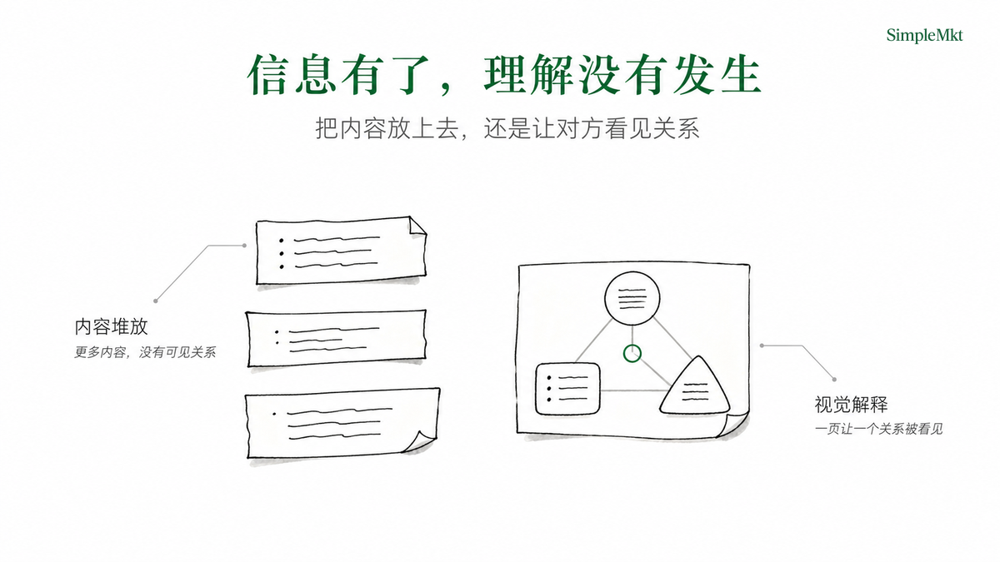
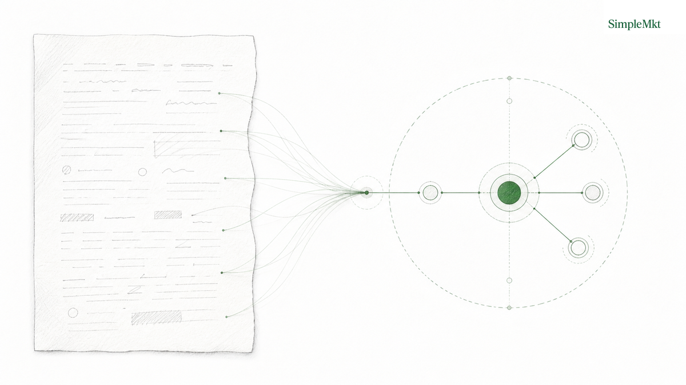

<div align="center">

# smkt-article-visual

**让重要判断，不再被做成普通 PPT。**

把你已经想清楚、但对方还没看明白的判断，<br>
做成真正讲得明白的 PPT。

不是把大纲塞进条目、卡片和模板，<br>
而是把机制、边界、取舍、路径与论证，<br>
转化成观众更容易接住的视觉解释。

从已有文章、报告、方案、讲稿或飞书文档出发；<br>
不补造结论，也不让原意在视觉化时走偏。

[SimpleMkt](https://simplemkt.cc) · [X](https://x.com/AlchemistZhou) · [小红书](https://www.xiaohongshu.com/user/profile/65a0ecb4000000002201219c) · [抖音](https://www.douyin.com/user/MS4wLjABAAAArV0uXvsSYl6pD-p5nr-5OFlZED5cEUnb7r2K6j9u4tA)

[官方仓库](https://github.com/Lone3m-tech/smkt-article-visual) · [当前发布 v0.8.1](https://github.com/Lone3m-tech/smkt-article-visual/releases/tag/v0.8.1) · [查看 Releases](https://github.com/Lone3m-tech/smkt-article-visual/releases) · [运行契约](SKILL.md)

**简体中文 | [English](README.en.md)**

</div>

> 给已经有观点、有判断、有内容的人：当你真正要对外讲清楚一件事，PPT 的任务不是装下更多字，而是替听众完成理解。

## 1. 你不是缺一份 PPT，而是缺一套让对方听懂的视觉解释

你可能已经写完了文章、报告、方案或演讲稿，也已经知道结论是什么。难的部分在于：听众第一次接触这套判断时，往往还得自己在脑中拼出结构。

于是演示页很容易滑向两种结果：

- **信息有了，理解没有发生**：更多条目、卡片、箭头和模板，只是把原文重新摆一遍。
- **看起来有图，判断却走偏**：为了“出效果”补出来源没有说过的因果、数据或结论。

`smkt-article-visual` 做的是中间这一层工作：从你的来源中找出读者必须看明白的一个关系，再把它做成一张能支撑讲述的页面。每张正文页只做一个理解动作，且能回到原文审核。

| 普通 AI PPT 的默认路径 | smkt-article-visual 的路径 |
| --- | --- |
| 大纲 / 文件 → 内容填充 → 模板布局 | 已有判断 → 读者卡点 → 可视化解释 → 可连续讲述的页面 |
| 重点是“把内容放上去” | 重点是“让对方不必自己重建关系” |
| 常见结果是文本、卡片和线条的组合 | 结果是一页一个判断、一页一个可见的理解关系 |



它不是可编辑 PPTX、HTML Deck 的前置工序；它直接交付可展示、可按序讲述、也可放进任意演示载体的视觉页面。

## 2. 一场重要讲述，应该长成什么样

封面先建立承诺，目录帮助听众定位；正文把关键判断逐页讲清楚，结尾负责收束。下面是一组真实的页面身份，而不是一张“效果示意图”。

| 1. 建立问题 | 2. 告诉听众将如何理解 | 3. 解释系统关系 |
| --- | --- | --- |
|  |  |  |

| 4. 让差异被看见 | 5. 划清边界 | 6. 留下结束感 |
| --- | --- | --- |
|  |  |  |

你得到的不是一堆单张配图，而是一套能顺着讲下去的视觉叙事：它保留你的判断，同时替听众降低理解负担。

## 3. 13 种让复杂判断被看懂的方式

图法不是模板库，也不是“选一个好看的版式”。它们是 13 种不同的理解动作：系统如何组成、事情如何流动、差异在哪里、边界如何划分、观点凭什么成立。

封面、目录和结尾管理注意力；13 种正文图法管理理解。下面的 4 × 4 总览由 **封面 × 1、目录 × 1、图法 × 13、结尾 × 1** 组成；实际项目可从 4 种封面、4 种目录和 3 种结尾中选择合适的节奏。

| 封面：`text_left_carrier_right` | 目录：`centered_list` | 架构：`architecture` | 层级：`hierarchy` |
| --- | --- | --- | --- |
|  |  |  |  |

| 流动：`flow` | 循环：`loop` | 决策：`decision_tree` | 对比：`comparison` |
| --- | --- | --- | --- |
|  |  |  |  |

| 矩阵：`matrix` | 交集：`overlap_map` | 边界：`boundary_map` | 论证：`argument_map` |
| --- | --- | --- | --- |
|  |  |  |  |

| 时间线：`timeline` | 连续谱：`continuum` | 层叠：`layer_stack` | 结尾：`editorial_signoff` |
| --- | --- | --- | --- |
|  |  |  |  |

完整的页面变体可在 [`examples/demo-cover/`](examples/demo-cover/)、[`examples/demo-agenda/`](examples/demo-agenda/) 与 [`examples/demo-closing/`](examples/demo-closing/) 查看。

## 4. 它怎样把你的判断做成页面

### 第一步：先判断听众会卡在哪里

Skill 从一段精确的来源支持出发：它不把整篇内容扔进一张图，而是明确这一页要让读者理解什么、必须看见什么、哪一种关系最合适。

### 第二步：每一页只完成一个理解动作

把“架构、层级、流程、循环、取舍、边界、论证……”中的一种做成主关系。标题、小标题、标签和必要说明共同服务这一个动作，不让装饰抢走判断。

### 第三步：再把页面按讲述顺序落位

它会按选择的交付方式组织封面、目录、正文和结尾；每张接受图都保留来源、图法、Prompt、生成状态和落位记录，方便复核或局部重做。


## 5. 你可以怎样使用它

### 把文章或报告变成一场能讲清楚的分享

适合策略报告、研究解读、咨询方案、客户提案、培训材料或创始人演讲。来源可以是可访问的 Markdown、可导出的本地文档，或已授权可读取的飞书文档；非 Markdown 内容会先规范为本地 Markdown 工作副本，原始材料不会被回写。

当你明确要做演示、slides、deck 或 PPT 时，使用 `presentation_frames`：输出按叙事顺序排列的可展示页面，源文保持不变。

```yaml
source_path: ./your-story.md
delivery_mode: presentation_frames
mode: plan
existing_assets: []
```

先让 Agent 给出计划，再确认生成：

> 为 `your-story.md` 制作一套演示页。先给我逐页计划，说明每页的来源支持、读者卡点、图法和必须出现的标签；确认后再生成。不要改写原文。

### 也可以保留为文章视觉包

默认的 `article_package` 会在 H1 后放封面，并在每个已批准的段落锚点后放一次正文图；文章正文不改写。它适合内容文章、长报告阅读页或需要边读边理解的材料。

| `article_package` | `presentation_frames` |
| --- | --- |
| 阅读时在对应段落获得解释 | 讲述时按页面顺序获得解释 |
| H1 后放封面；锚点后各放一次正文图 | 封面、必要的目录、讲述页、结尾 |
| 原文不改写 | 源文不改写 |


## 6. 内置示例


[《为什么清洗后的运动鞋不宜直接贴近暖气烘干？》](examples/demo-article/article.md)

## 7. 安装与已验证 Agent

把下面这行直接发给你的 Agent：

```bash
请帮我安装这个 Skill：https://github.com/Lone3m-tech/smkt-article-visual
```

安装成功只说明文件已就位；完整工作流仍要求宿主能读写本地文件，并能调用等效的图像生成能力。

已完成实际运行的宿主：

-  **Codex**：已验证本地文件读写、页面级 Prompt 编译、图像生成与终处理。
- **WorkBuddy**：已实测可完成工作流，但会丢失不少画面与版式细节，不应视为与 Codex 等同的完整视觉还原。

未通过完整工作流实测的宿主：

- **豆包**：实测不可行；当前 Agent 路径无法稳定承接完整页面 Prompt。

Logo 归 OpenAI 所有，仅用于识别已实测 Agent；名称与结论均不暗示背书或合作。

## 8. 依赖与限制

- 需要一个可读写本地文件、并能调用 `image_gen` 或等效能力的 Agent 宿主。
- Logo 终处理需要 Python 3.10+ 与 [`scripts/requirements.txt`](scripts/requirements.txt) 中的 Pillow；Skill 不会自动安装依赖，也不会用另一套渲染器修补生成图。
- 完整视觉效果依赖宿主的图像生成能力，不能仅凭安装成功推断。
- 每次使用者仍须确保输入素材、第三方图像模型条款与再分发授权合规。

## 更喜欢上一版的风格？

如果你更喜欢上一版的暖白纸张感与编辑插画处理，欢迎下载 [v0.7.0](https://github.com/Lone3m-tech/smkt-article-visual/releases/tag/v0.7.0)。

<p align="center">
  
</p>

## License

[MIT License](LICENSE)
