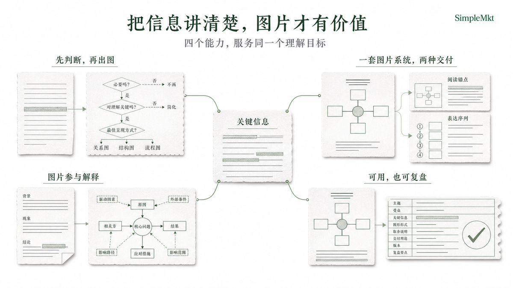

<p align="center">
  
</p>

<div align="center">

# smkt-article-visual

**Turn a narrative's key judgments into images people can understand at a glance—and keep presenting from.**

Turn a structured narrative—an article, talk, report, proposal, or workshop outline—into a shared system of cover and content images. It decides what needs to be shown, selects the right visual grammar, and delivers a traceable image package in the SimpleMkt editorial style. `article_package` places content images where a reader needs them; `presentation_frames` orders the same image system into a spoken narrative.

Built for Codex and image-generation capable Agents.

[SimpleMkt](https://simplemkt.cc) · [X](https://x.com/AlchemistZhou) · [Xiaohongshu](https://www.xiaohongshu.com/user/profile/65a0ecb4000000002201219c) · [Douyin](https://www.douyin.com/user/MS4wLjABAAAArV0uXvsSYl6pD-p5nr-5OFlZED5cEUnb7r2K6j9u4tA)

[Official repository](https://github.com/Lone3m-tech/smkt-article-visual) · [Releases](https://github.com/Lone3m-tech/smkt-article-visual/releases)

[View the complete demo](examples/demo-article/article.md) · [Read the runtime contract](SKILL.md)

**English | [简体中文](README.zh-CN.md)**

</div>

## Why this Skill

| Product advantage | What it means in practice |
| --- | --- |
| **Plan before pixels** | Finds the actual understanding obstacle, chooses one visual grammar, and names the source details that must remain visible before generating an image. |
| **One image system, two generation strategies** | Uses one cover template and one content-image template. `article_package` supports a local reading moment; `presentation_frames` turns approved source slices into a continuous spoken narrative. |
| **Images explain, not decorate** | Gives every paper element, sketch, label, and leader a role in the source relationship. A content image answers one primary question rather than filling space beside text. |
| **Ready to use and review** | Places article images at their approved anchors, records prompts and adjustments in one manifest, applies the Logo deterministically, and completes only after QA. |



The shared purpose is simple: lower cognitive load so creators can communicate the information already present in their narrative with more clarity.

## Install

Copy either command to your Agent or run it in a terminal. Prefer `npx`; use `git clone` when `npx` is unavailable.

### npx (recommended)

```bash
npx skills add Lone3m-tech/smkt-article-visual \
  --skill smkt-article-visual \
  --global \
  --agent codex \
  --copy
```

### git clone

```bash
mkdir -p ~/.codex/skills
git clone --depth 1 https://github.com/Lone3m-tech/smkt-article-visual.git \
  ~/.codex/skills/smkt-article-visual
```

Remove `--global` for a project installation. For Claude Code, replace `--agent codex` with `--agent claude-code` and use `~/.claude/skills/smkt-article-visual` as the clone destination.

## Runtime compatibility

- **Primary validated host:** Codex with the host `image_gen` capability.
- **Required capability:** An Agent that can invoke image generation and read and write local files.
- **Image model:** Selected by the host runtime. This Skill does not pin a specific image model.
- **Other Agents:** Installation can succeed, but complete generation still requires an equivalent image-generation capability.

## Shared workflow

Every delivery follows these three stages. They are workflow stages, not the two output choices below.

| Mode | What the Skill does | What it does not do yet |
| --- | --- | --- |
| `plan` | Finds the audience obstacle, selects one visual grammar, names the required source details, and sets delivery placement or narrative order. | Generate artwork or alter the source. |
| `generate` | Creates the accepted cover and content images; records the actual prompt and every revision; places article content images at their approved anchors. | Rewrite the source prose. |
| `qa` | Checks meaning, grammar topology, type hierarchy, Logo reserve, disclosure, file placement, and manifest acceptance. | Call a generated image finished merely because it exists. |

The normal sequence is `plan → generate → qa`. A direct-generation request may skip plan acceptance, but it still creates a plan before producing assets.

## Choose your delivery

Both choices use one cover template and one content-image template to lower cognitive load and make source information easier to follow. They use different generation strategies. Use `article_package` when readers will follow the content independently. Use `presentation_frames` when a presenter leads the audience through a spoken argument in sequence.

| Question | `article_package` | `presentation_frames` |
| --- | --- | --- |
| Typical request | “Add a cover and body figures to this article” or “place visuals back into the article.” | “Turn this article or script into image-style PPT,” “presentation frames,” or “a sequence I can present from.” |
| How the audience receives it | Reads an article or report, with a figure at the relevant passage. | Follows a speaker, proposal, workshop, or lesson in narrative order. |
| Image unit | One shared-style cover, then content images placed as explanatory body figures. | One shared-style cover, then the same kind of content images ordered as Frame 01, Frame 02, Frame 03 … to carry one unfolding argument. |
| Generation strategy | Starts from one paragraph, offloads its local reader obstacle, preserves its concrete source detail, and avoids repeating prose the reader has just read. | Starts from a narrative slice, establishes a hook, tension, mechanism, reframe, or resolution, and makes the next frame necessary while remaining readable alone. |
| Delivery is complete when | The cover and figures resolve once at their exact reading anchors in the Markdown source. | The cover resolves first, then every approved frame resolves once in the agreed narrative sequence recorded in the manifest; the source prose remains untouched. |
| Best input | Finished Markdown article or report with an H1 title. | Speech script, proposal outline, workshop, or teaching script; provide a presentation title when it has no H1. |


The difference begins before delivery: article images optimize for the local reading moment; presentation images optimize for continuity between speaking beats. The visual contract stays shared, but the two modes do not default to the same image selection, source scope, semantic framing, density, or composition. When the same source also has an article package, set `presentation_output_root` for the presentation run so its ordered assets and manifest remain separate.

## From text to a visual people can follow

An attractive image is not enough when the audience needs to understand a process, comparison, hierarchy, boundary, or key judgment. The Skill starts from the narrative: it identifies the point that needs explaining, chooses a grammar, generates the image, and records the prompt, revisions, and QA in one manifest.

## Where it helps

| Scenario | Input | Delivery | What it delivers |
| --- | --- | --- | --- |
| Article or report | A finished Markdown article or research report with an H1 title | `article_package` | A cover and explanatory figures placed at their exact reading anchors. |
| Talk or keynote | A speech script or presentation outline | `presentation_frames` | A presentation cover and an ordered explanation sequence for the key judgments worth showing. |
| Consulting proposal | A strategy narrative or proposal | `presentation_frames` | A cover-led narrative sequence that makes a mechanism, option, or recommendation easier to present. |
| Internal alignment | A strategy memo or retrospective | Either, based on whether people read or are led through it | Shared pictures of decisions, boundaries, systems, and handoffs. |
| Workshop or course | A teaching outline or lesson script | `presentation_frames` | A cover and memorable teaching sequence that turn abstract concepts into a visible relationship. |


## What it explains

| Reading or speaking obstacle | What it does |
| --- | --- |
| A process is hard to follow | Preserves steps, order, and handoffs with a flow figure. |
| Two approaches are hard to compare | Places the difference in one reading path. |
| A system relation is abstract | Preserves structure with a hierarchy, boundary, or relation figure. |
| Text and images have drifted apart | Places the figure at its exact article anchor or turns the narrative into a cover-led, self-contained presentation sequence. |

## Who it is for

- Creators and speakers who need a complex judgment to land quickly with an audience.
- Content teams, consultants, researchers, and educators producing consistent explanatory visuals.
- Authors or presenters who already have a narrative argument and need images to explain it—not a rewrite.

## Who it is not for

- A standalone poster, mood image, or social-media cover with no explanatory task.
- Article writing, publishing, logo design, or a full PPTX / slide-deck production workflow.
- Fabricating screenshots, charts, or factual evidence.


## Core capabilities

### Confirm what the figure must explain

Not every heading or spoken paragraph deserves a figure. The Skill first creates a visual plan that states the reader or audience obstacle, grammar, delivery choice, placement or frame order, and source details that must remain visible.

### Translate narrative relationships into the right grammar

Narrative structure decides what needs explaining. Visual grammar makes flow, comparison, hierarchy, or boundaries legible. The editorial master keeps a package or frame series visually coherent.

### Deliver image, placement, and record together

For articles, each content image is placed after its corresponding paragraph. For talks and proposals, a presentation cover leads an ordered sequence of the same content-image template with explicit narrative handoffs. The manifest records every attempt, adjustment reason, Logo result, accepted version, and the stable cover/content-image sequence; this is an image-sequence delivery, not a PPTX file. Generation is not complete until the selected delivery mode and QA pass.

## Visual grammar library

Choose one primary grammar for each figure. Start with the relationship an audience needs to understand, then select the structure; a shared visual style must not flatten different questions into one layout.

| Grammar | Example |
| --- | --- |
| Architecture |  |
| Flow |  |
| Loop |  |
| Decision tree |  |
| Comparison |  |
| Matrix |  |
| Overlap map |  |
| Boundary map |  |
| Argument map |  |
| Timeline |  |
| Continuum |  |
| Layer stack |  |
| Annotated source |  |

## Complete demo

The bundled demo source is “Open-source illustration Skill: images are part of the explanation.” Its article-package and presentation-frame image packages are being rebuilt from the current shared-template, mode-specific generation contract.

[Open the demo article](examples/demo-article/article.md)

## Default visual style

This release uses one cover template and one content-image template across both delivery modes. It keeps a series coherent without forcing every relationship into the same layout; image role and visual grammar decide the shared visual language, while delivery mode decides the source scope and semantic framing used to generate each image.


- **Cover and content images have different jobs.** The cover is a quiet PPT cover: the article H1 is preserved character-for-character, supported by one dominant visual metaphor. Every content image—an article body figure or a presentation frame—uses the same explanation template: centered core judgment, one short subtitle, then one dominant relationship.
- **Type has a reading order.** Content-image titles stay smaller than cover titles, are centered in one fixed upper band, and never compete with the top-right Logo reserve. Chinese uses one editorial serif family; English identifiers use a restrained companion face; handwritten semantic text is rejected.
- **Elements carry meaning before labels do.** Source and claim use an excerpt sheet, stages and outputs use narrow paper strips, decisions and boundaries use cut-paper fields, and positions or changes use direct ink, hatch, or anchors. Empty paper cards with a label are not enough.
- **Sketching must explain.** An engraving or pencil-sketch subject is allowed only when it comes from the article's actual relation or source detail, then receives direct labels and hairline leaders. It never defaults to plants, generic objects, icons, or decorative metaphors.
- **The finish stays editorial, not UI-like.** Pure white canvas, fine low-contrast lines, one faint paper elevation, restrained forest-green emphasis, and no dashboard cards, heavy arrows, decorative grids, crop marks, or floating ornament.
- **The Logo is deterministic.** The packaged wordmark is placed after generation in a protected white reserve. No model-rendered Logo, title, label, or connector may enter that area.
- **The style protects meaning and trust.** No heading automatically earns a figure; one figure answers one primary question with one primary grammar. Article prose stays intact and every accepted image path appears once at its approved anchor. Non-factual examples carry the lower-left disclosure `图中示例仅为解释用途，并非事实`; generated work is never presented as a real screenshot, source, or fact.

## License

Released under the [MIT License](LICENSE).
