# smkt-article-visual

> 把每个关键判断，讲成一张看得懂的图。

[English](README.md)

把文章、演讲稿、报告、提案或工作坊提纲这类结构化叙事，变成一组统一、可解释的图片。它判断什么值得画，选择合适图法，并以 SimpleMkt 编辑图风格交付可追溯的图片包。

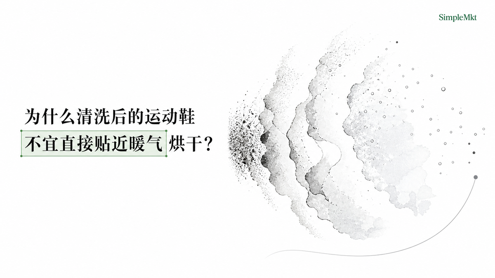

[查看完整 Demo](examples/demo-article/article.md) · [查看 Skill 运行契约](SKILL.md)

## 安装

```bash
npx skills add Lone3m-tech/smkt-article-visual \
  --skill smkt-article-visual \
  --global \
  --agent codex \
  --copy
```

手动安装：

```bash
git clone --depth 1 https://github.com/Lone3m-tech/smkt-article-visual.git
mkdir -p ~/.codex/skills
cp -R smkt-article-visual ~/.codex/skills/smkt-article-visual
```

项目内安装时去掉 `--global`；安装到 Claude Code 时把 `--agent codex` 改为 `--agent claude-code`。

## 30 秒开始使用

提供本地 Markdown 源文件，并选择交付模式：

```yaml
source_path: ./article.md
delivery_mode: article_package
mode: plan
```

`article_package` 会把封面与正文解释图落回文章。演讲稿、报告、提案或工作坊提纲需要独立讲述图时，使用 `presentation_frames`：

```yaml
source_path: ./talk.md
delivery_mode: presentation_frames
mode: plan
```

先查看 visual plan；确认后使用 `mode: generate`。如果已经明确要直接生成，也可以在请求中说明。

## 从文字判断到看得懂的图

当读者或听众需要理解一个流程、比较、层级、边界或关键判断时，一张好看的图还不够。Skill 从叙事本身出发：找出需要被解释的点，选择图法，生成图片，并把 Prompt、调整记录与 QA 收在同一份 manifest 中。

## 用在哪些场景

| 场景 | 输入 | 它会交付什么 |
| --- | --- | --- |
| 文章或报告 | 完成的 Markdown 文章或研究报告 | 在准确阅读锚点落位的封面与正文解释图。 |
| 演讲或分享 | 演讲稿或分享提纲 | 每个值得展示的关键判断，对应一张独立讲述图。 |
| 咨询提案 | 策略叙事或提案 | 让机制、选项或建议更容易被讲清楚的解释页。 |
| 内部对齐 | 战略 memo 或项目复盘 | 共同理解决策、边界、系统与交接关系的图。 |
| 工作坊或课程 | 教学提纲或课程脚本 | 把抽象概念变成可讲、可记的教学图。 |

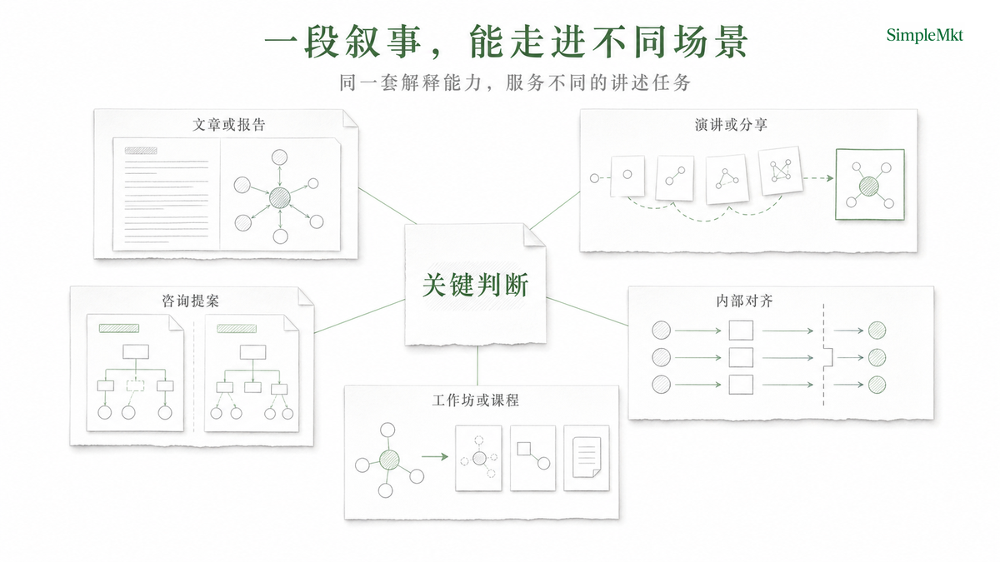

## 它解释什么

| 阅读或讲述中的难点 | 它会做什么 |
| --- | --- |
| 一个流程读起来太绕 | 用流程图保留步骤、先后与交接关系。 |
| 两种做法不容易比较 | 用对比图把差异放到同一阅读路径里。 |
| 系统关系太抽象 | 用层级、边界或关系图保留结构。 |
| 图文或讲述脱节 | 让图片落在准确文章锚点，或交付为自洽的独立讲述图。 |

## 适合谁

- 希望让复杂判断更快被读者或听众理解的创作者与分享者。
- 需要稳定产出解释图的内容团队、咨询师、研究者与教育者。
- 已经有叙事观点，需要图片帮它解释，而不是重写内容的作者或演讲者。

## 不适合谁

- 没有解释任务、只追求氛围的海报、情绪图或社媒封面。
- 文章写作、发布、Logo 设计，或完整 PPTX / Deck 制作流程。
- 伪造截图、图表或事实证据。

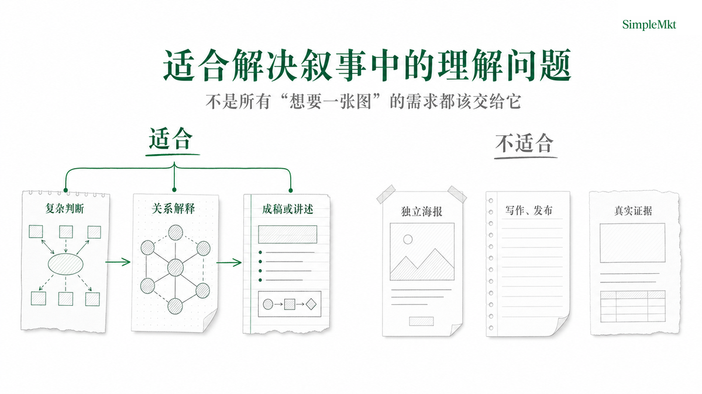

## 核心能力

### 先确认“这张图要解释什么”

不是每个标题或每段口述都强行配图。Skill 先生成 visual plan，明确读者或听众的卡点、图法、交付模式、落位或出场顺序，以及不该画的内容。

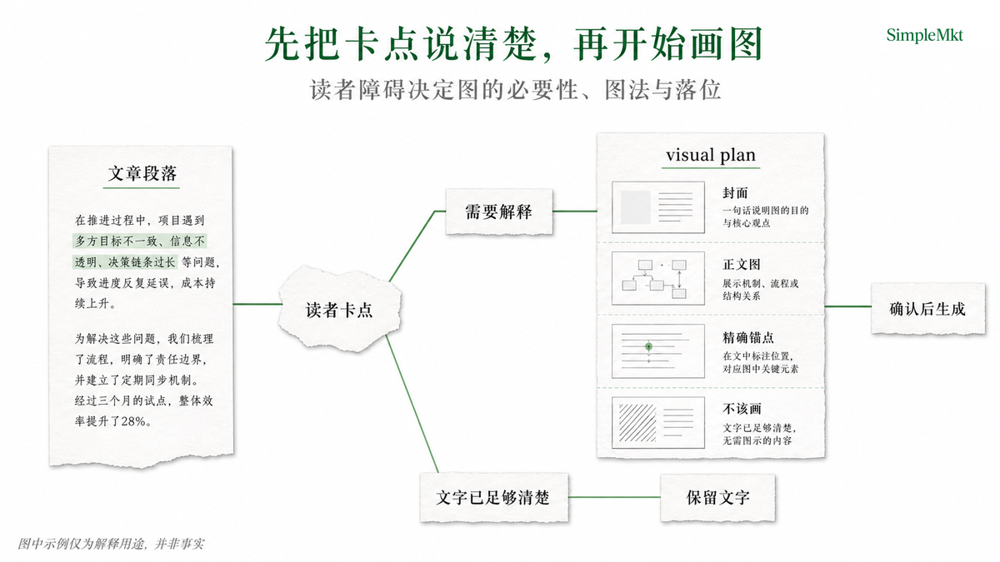

### 把叙事关系翻译成合适的图法

叙事结构决定要解释什么；图法决定流程、对比、层级或边界如何被看见；视觉方向负责让一组配图或一组讲述图读起来像同一个系列。

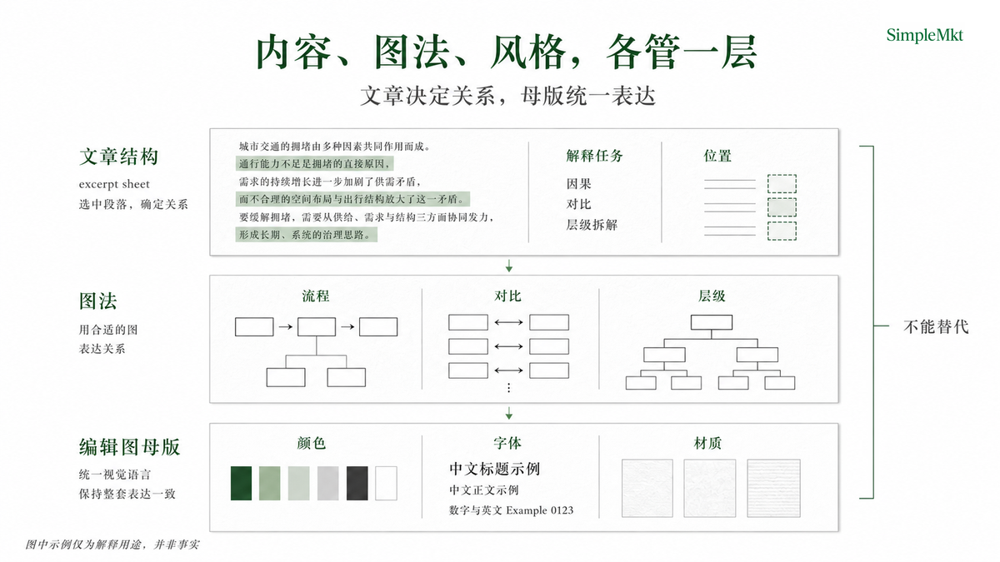

### 图像、落位与记录一起交付

文章模式会把每张图落在对应段落后；演讲和提案模式会按叙事顺序交付独立图片。一份 manifest 记录每次生成、调整原因、Logo 结果与最终采用版本。生成完成不等于交付完成，所选交付模式与 QA 通过才算结束。

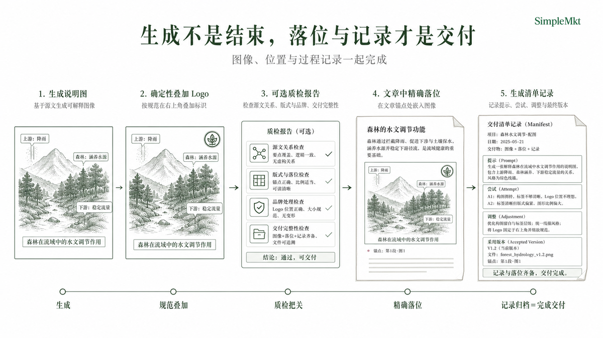

## 交付模式

| 模式 | 最适合 | 你会得到什么 |
| --- | --- | --- |
| `article_package` | 文章与报告 | `cover.png`、正文解释图、文章内落位与一份 manifest。 |
| `presentation_frames` | 演讲、提案、工作坊与教学脚本 | 每个已确认关键判断对应一张按叙事顺序命名的独立讲述图，加一份 manifest；不改写源文件。 |

```text
source.md
assets/image/
├── cover.png                       # 仅 article_package
├── <figure-or-frame-id>.png
└── manifest.json
```

`manifest.json` 为每张图追加生成尝试；`accepted_attempt` 指向当前采用版本。Skill 不改写源文件正文。

## 图法库

一张图只选一个主图法：先看读者或听众需要理解哪一种关系，再选结构，不让统一风格把不同问题画成同一种版式。

| 图法 | 示例 |
| --- | --- |
| Architecture（架构） | 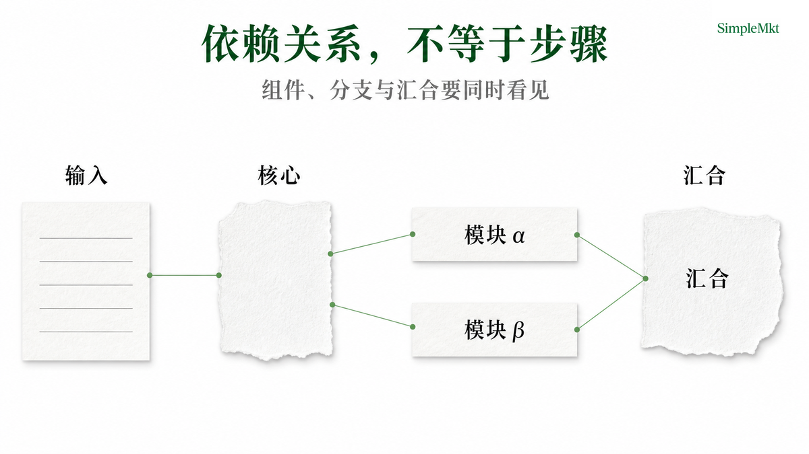 |
| Flow（流程） | 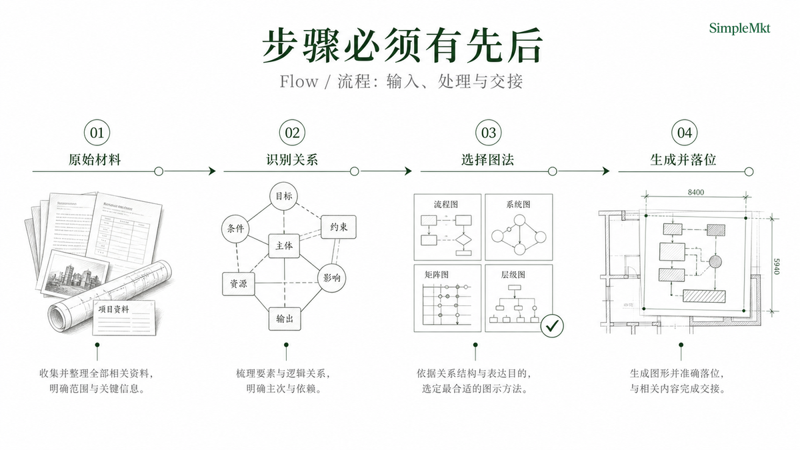 |
| Loop（循环） | 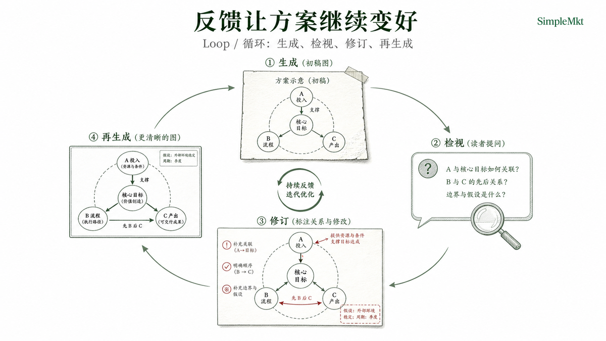 |
| Decision tree（决策树） | 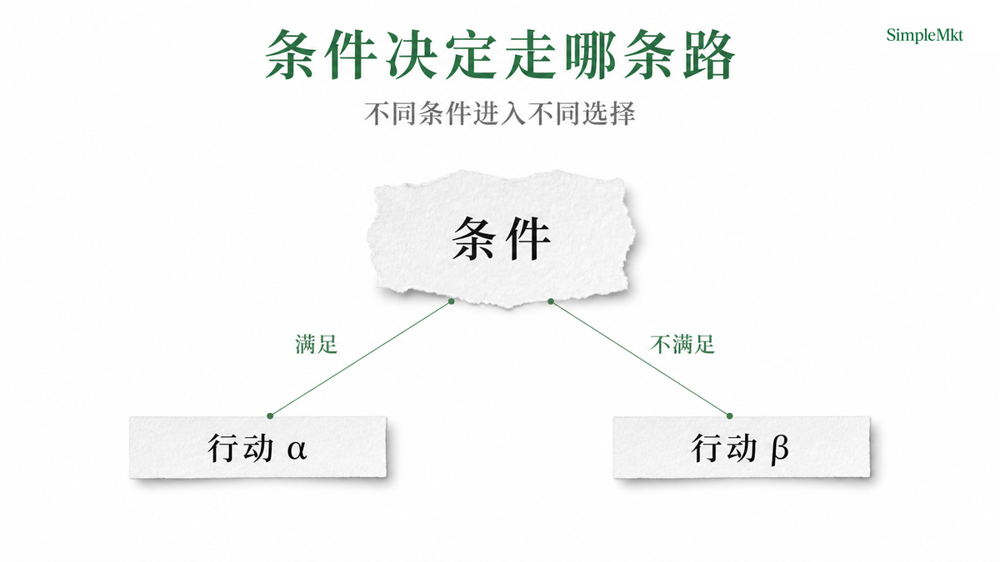 |
| Comparison（对比） | 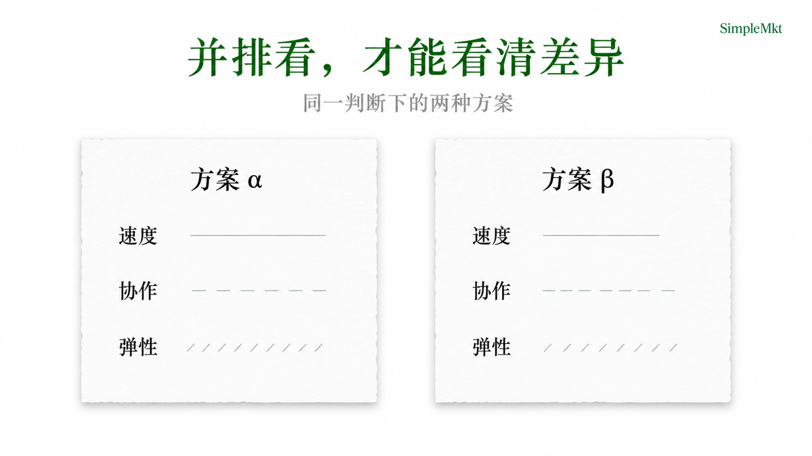 |
| Matrix（矩阵） | 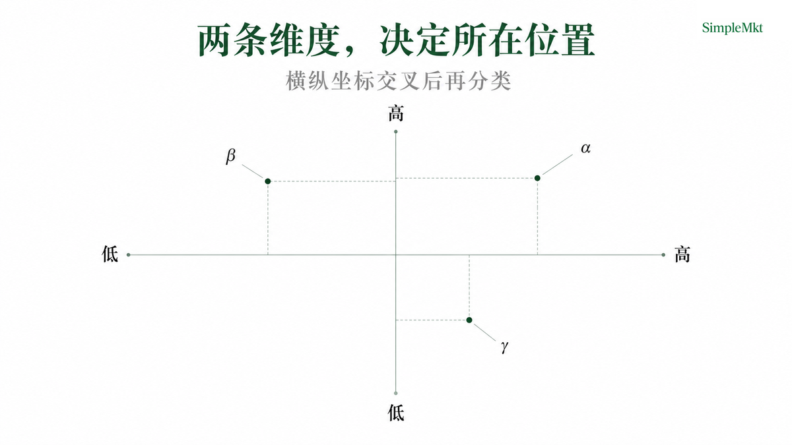 |
| Overlap map（交集） | 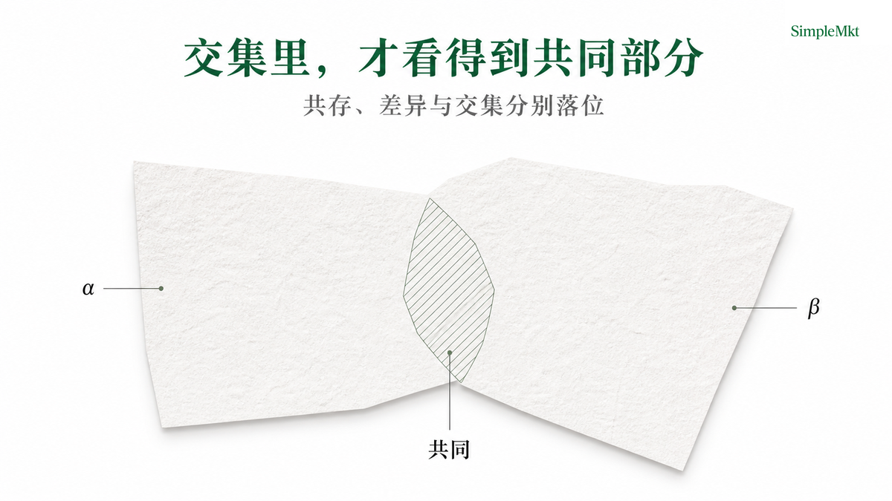 |
| Boundary map（边界） | 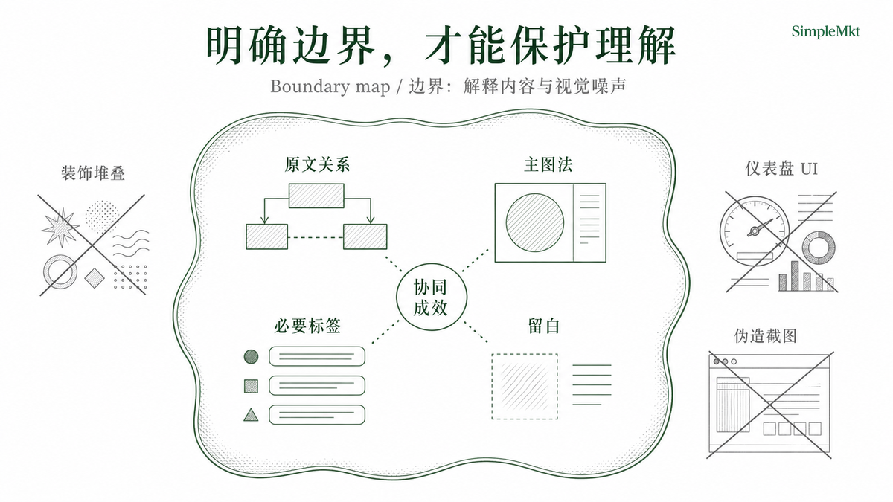 |
| Argument map（论证） | 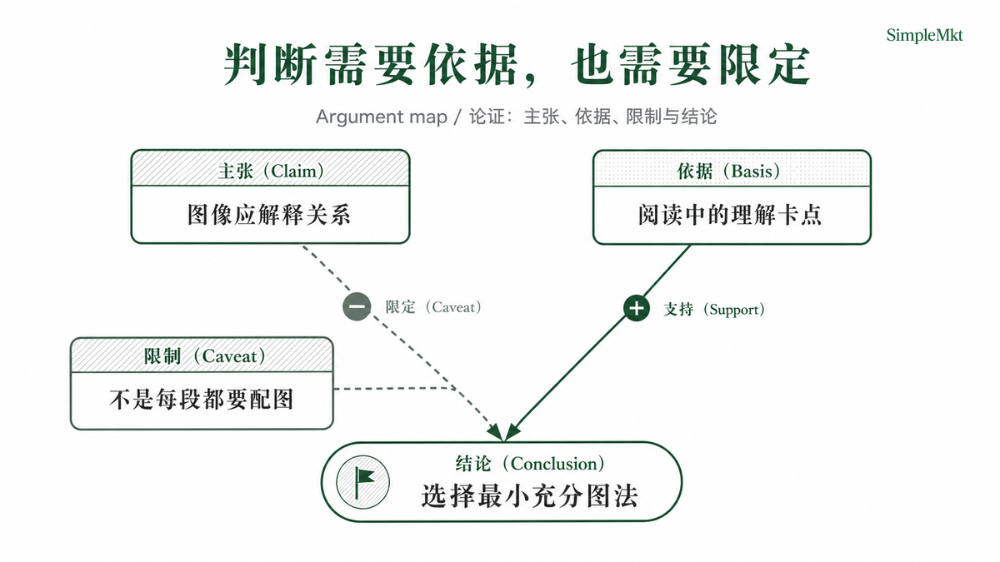 |
| Timeline（时间线） | 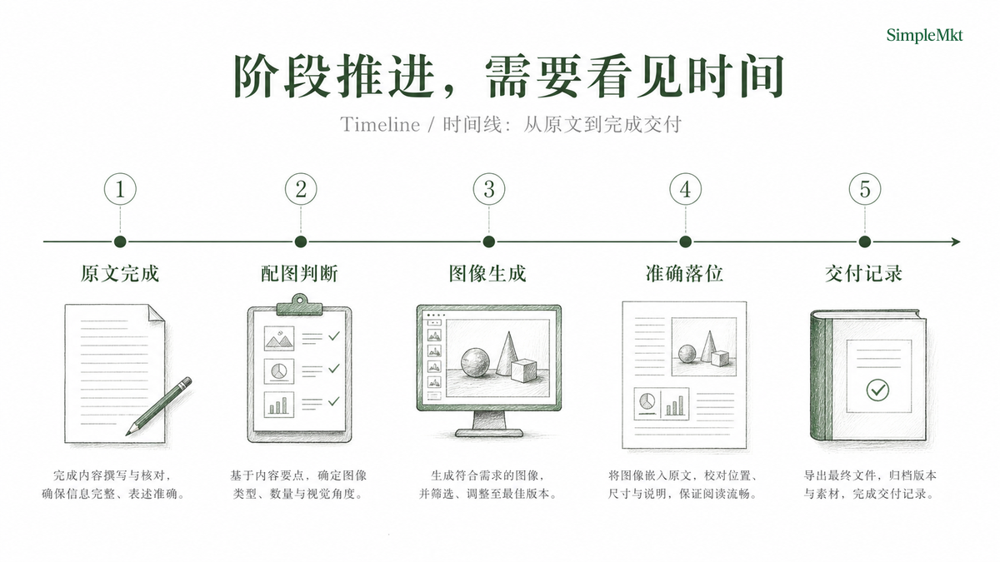 |
| Continuum（连续谱） | 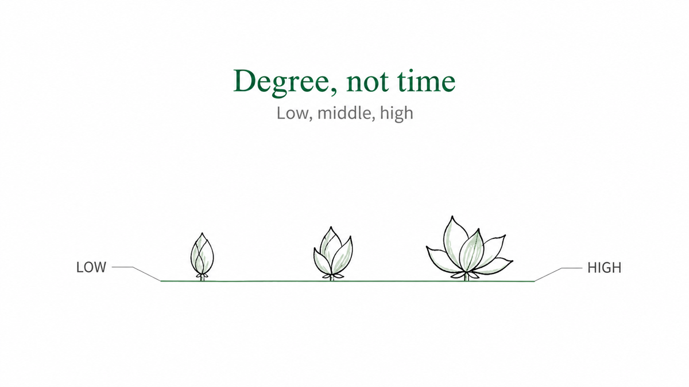 |
| Layer stack（层级） | 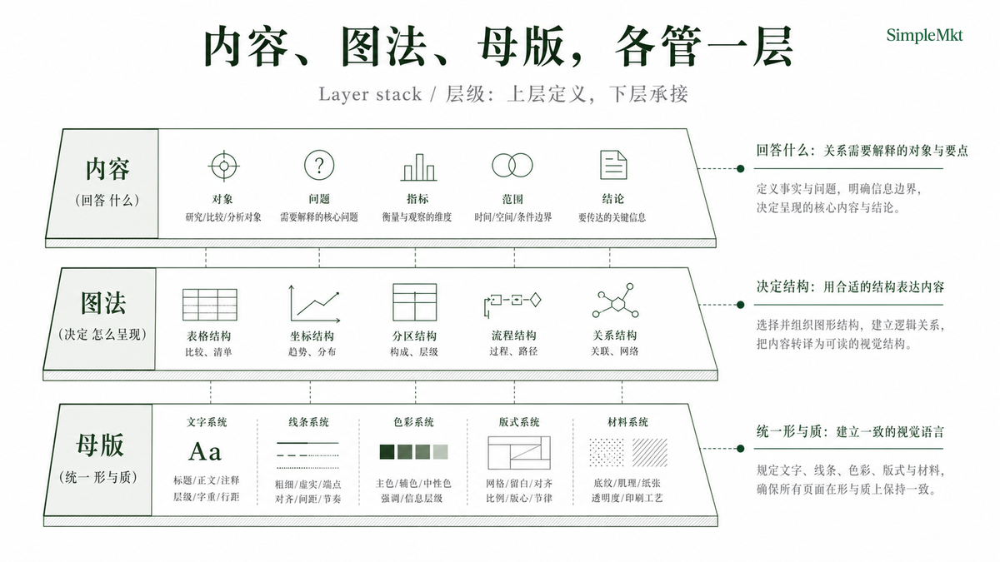 |
| Annotated source（来源标注） | 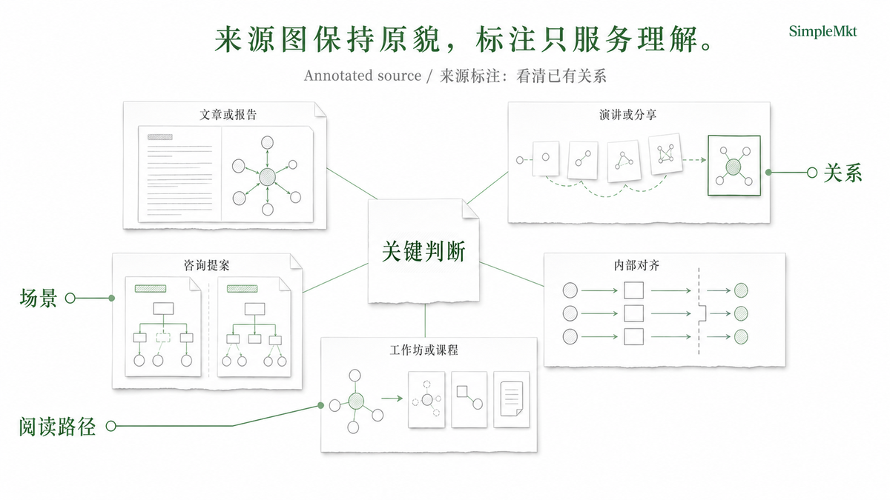 |

## 完整 Demo

Demo 使用《开源配图Skill：配图不是装饰，而是解释的一部分》这篇文章，包含一张封面与六张正文解释图。

[打开 Demo 文章](examples/demo-article/article.md)

## 默认视觉方向与边界

默认使用 SimpleMkt 编辑图风格：纯白画布、清晰的标题层级、细线关系、克制材质与统一 Logo。它不把生成图当作真实截图或事实证据；非事实示例会使用明确备注。

## License

本包采用 [MIT License](LICENSE) 开源。
