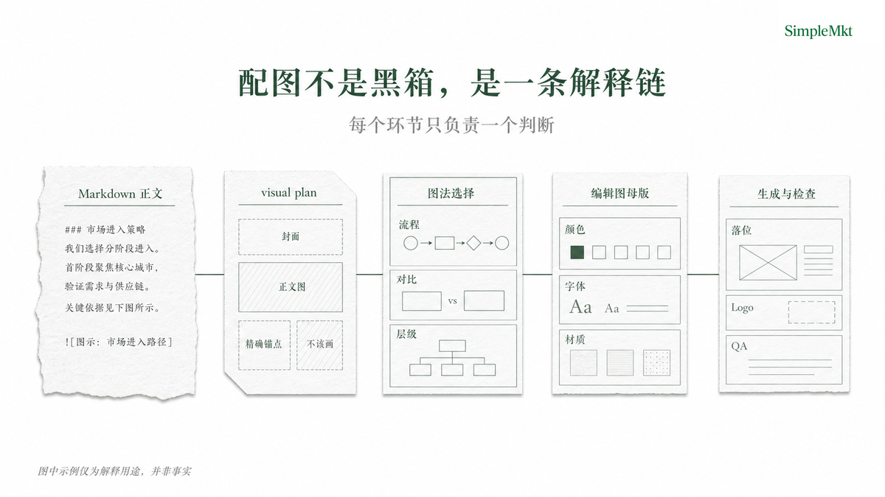
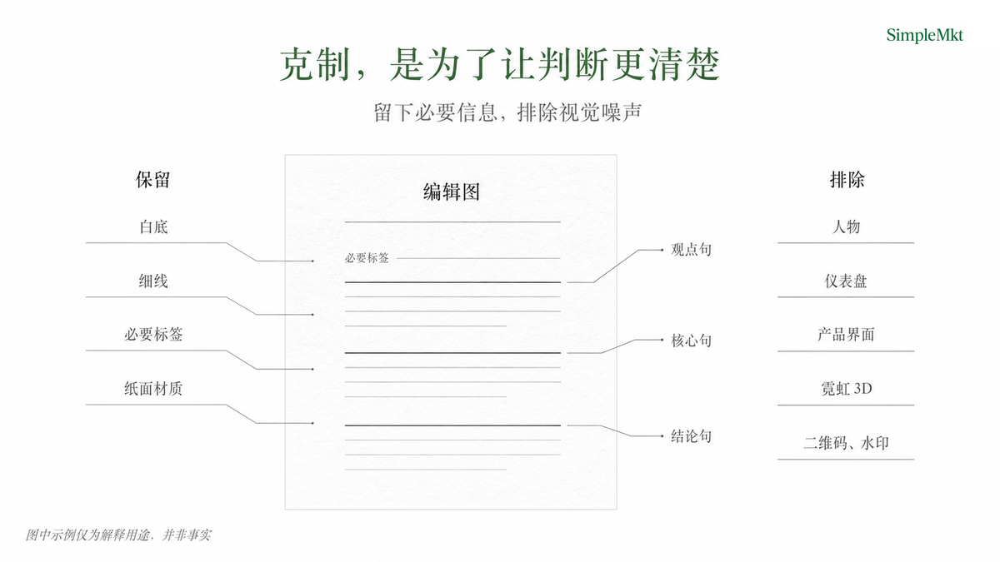

# 开源配图Skill：配图不是装饰，而是解释的一部分

一篇文章写到最后，最容易出现一个让人泄气的场景：正文已经打磨好了，只差“配几张图”。于是有人临时打开生图工具，写几句提示词；有人在图库里翻半天；还有人干脆把文章发出去。结果常见的麻烦是图和文章各说各话——标题很漂亮，读者却还是没看懂流程；配图很精致，放进正文却像一张无关的海报。

我做 SMKT Article Visual，想解决的就是这件小而顽固的事：**不要把文章配图当成最后五分钟的装饰工作，而要把它当成文章解释力的一部分。** 它是一个面向完成或接近完成的 Markdown 文章的视觉包装 Skill。你把文章交给它，它不替你改观点、不替你编资料，而是帮助你判断哪里真正需要图、这张图该解释什么、应该紧跟哪段文字，以及最后如何被检查。

## 先说清楚：它解决的是文章配图

如果你只需要一张独立的海报、概念图或社交媒体配图，单图工具已经足够直接。SMKT Article Visual 服务的是另一种情况：文章里有一个读者光靠文字不容易一下看明白的关系，比如一套工作流程、两种做法的差别、一个系统的层级，或者某个边界在哪里。

你可以把它想成内容编辑和视觉设计之间的一位翻译。编辑负责文章说什么，图像负责读者看见什么；这个 Skill 的职责是把两者接起来，而不是用一张看起来“很 AI”的图覆盖掉文章本来要讲的东西。

## 它的架构很简单：文章是内容真源，图只是解释层

SMKT Article Visual 的设计刻意没有把文章、图法和生成动作混成一个黑箱。它由四个连续但职责不同的环节组成：先读取 Markdown 正文；再提出 visual plan；随后选择合适的 visual grammar；最后按固定编辑图母版生成、落位并 QA。

这套拆分的意义很朴素。文章回答“我要让读者理解什么”；visual grammar 回答“用流程、对比还是层级来讲”；固定编辑图母版回答“封面和正文图如何保持同一种 SimpleMkt 编辑感”；生成和 QA 则负责“有没有按约定落到文章里”。每一层都只负责自己的问题，所以视觉表达不会悄悄改掉一张图本来应该表达的关系。

## 功能一：先规划，再生成，避免图片反过来带偏文章

很多配图工作一开始就问“想要什么画风”。我更在意的第一个问题是：“读者在哪一段会卡住？”一篇文章并非每一段都需要图片；有些概念文字已经足够清楚，强行加图只会增加阅读负担。SMKT Article Visual 会先读标题、段落和已有表格，筛出真正需要视觉解释的位置。

它先把文章中的解释任务拆成一份可确认的 visual plan，明确封面、每张正文图、位置和不该画的部分。

这份 plan 像拍摄前的分镜，不是为了增加流程，而是让内容作者在生成之前就能判断：这张图是否值得做、读者看完应该懂什么、它是否会和正文重复。只有 plan 被确认，或你明确要求立即生成，才进入下一步。这样，图像是在服务文章，文章逻辑也不用为迁就一张图而改写。

## 功能二：把配图绑定到正文，而不是绑定到一句提示词

单张生图工具擅长响应一个画面提示；但当一篇文章要解释工作流、层级、对比或循环时，真正难的不是“画出几个元素”，而是保留元素之间的关系。流程图需要读者看见先后；对比图需要读者同时看见差别；层级图需要读者知道谁属于谁。图法选错，即使画面好看，解释也会跑偏。

真正的差别不在画风，在于它把正文里的关系、图法和落位一起当成交付的一部分。

| 维度 | 单张生图任务 | SMKT Article Visual |
| --- | --- | --- |
| 起点 | 一句画面提示 | 一篇 Markdown 文章与其段落关系 |
| 决策单位 | 单张图片 | 封面、正文图、图法与精确锚点 |
| 交付边界 | 得到一张图 | 图像、放置位置、prompt 旁车文件与 QA |
| 适合什么 | 独立海报、氛围图、单一概念 | 需要解释流程、比较、层级和边界的文章 |

所谓“绑定到正文”，不是在文末堆一组图片，而是让每张图紧跟它服务的那段话。读者刚读到关键判断，立刻能看到它被怎样压缩成一张图；读完图，回到文字时也不会失去上下文。这个小动作决定了配图是阅读的一部分，还是页面上的装饰。

## 功能三：把内容关系、图法和编辑图母版分开处理

第一次接触视觉系统的人，很容易把“内容”和“风格”当成同一件事：既然想做得更有品牌感，就先换颜色、加质感、找一种流行画风。但漂亮的风格不能替你说明复杂关系；反过来，一张关系正确却视觉散乱的图，也很难成为一组稳定内容的组成部分。

文章结构、图法和编辑图母版分别回答不同的问题，不能由其中一层替代另一层。

在这个 Skill 里，文章结构决定视觉任务和位置；visual grammar 决定用流程、对比、层级、循环或边界图来保存原有关系；固定编辑图母版则统一颜色、字体感、材质、留白和禁用项。你可以把它理解为盖房子：文章是房间要解决的生活需求，图法是承重结构，编辑图母版是光线、材料与家具。它服务结构，但不能替代结构。

## SimpleMkt 的视觉风格，不是“科技感模板”

SMKT Article Visual 默认继承 SimpleMkt 的视觉判断：克制、清楚、诚实。封面和正文图共享纯 `#FFFFFF` 白底的编辑画布，用森林绿宋体标题、细线关系、充足留白和必要标签来解释问题，右上角保留小型 `SimpleMkt` 字标；没有山水摄影、暖色纸感或淡绿色外框。

这意味着它有不少刻意的限制：不靠人物吸引注意力，不把正文图做成仪表盘或产品 UI，不用霓虹、泛滥的 3D 效果、二维码或水印填满画面，也不把生成图伪装成真实截图或外部证据。限制不是为了让所有图长得一样，而是避免视觉噪声抢走文章的判断。

这套母版并不是一张可以随意换皮的模板。它的颜色、字感、纸面、留白与标注行为是为了让封面和不同图法读起来仍像同一组内容；但流程、对比、层级和边界图必须各自采用合适的结构，不能为了“统一”而套成同一张版式。

## 功能四：让一次配图交付可检查，也能被下一次复用

生成图片不是结束。SMKT Article Visual 会为封面和每张正文图保留对应的 prompt 旁车文件；封面与正文图共用固定编辑图母版，封面放在文章开头，正文图按约定紧跟段落锚点。

右上角的品牌 Logo 也不交给模型临摹。它从 Skill 的品牌资产位直接叠加，尺寸、位置和标题避让区固定；品牌 Logo 更新后，后续生成的整套配图都会使用同一份新资产。最后 QA 会检查正文是否被改写、图片是否遗漏、图法是否正确、路径和尺寸是否合规，也会检查 Logo、标题和保留区是否各自在约定位置。

这套检查并不承诺“有图就会带来增长”，因为增长仍取决于选题、内容判断和读者本身。但它能把原本模糊的“这篇文章配得差不多了”，变成一组可以复查的条件：图是否真的解释了该解释的事，是否在对的位置，是否仍然忠实于正文。

SMKT Article Visual 也有明确不做的事：它不写文章、不发布内容、不做平台专用封面、不做 Logo 或整套 deck，更不会替没有来源的说法制造“证据图”。它只处理已经成立的文章逻辑，让需要解释的部分拥有恰当、可追溯、符合品牌气质的视觉表达。

对刚开始做内容的人来说，最重要的不是立刻学会复杂提示词，而是先建立一个简单判断：一张图存在的理由，应该是帮读者理解，而不是证明你也会生成图片。SMKT Article Visual 把这个判断变成了一套能执行、能检查的工作流。
